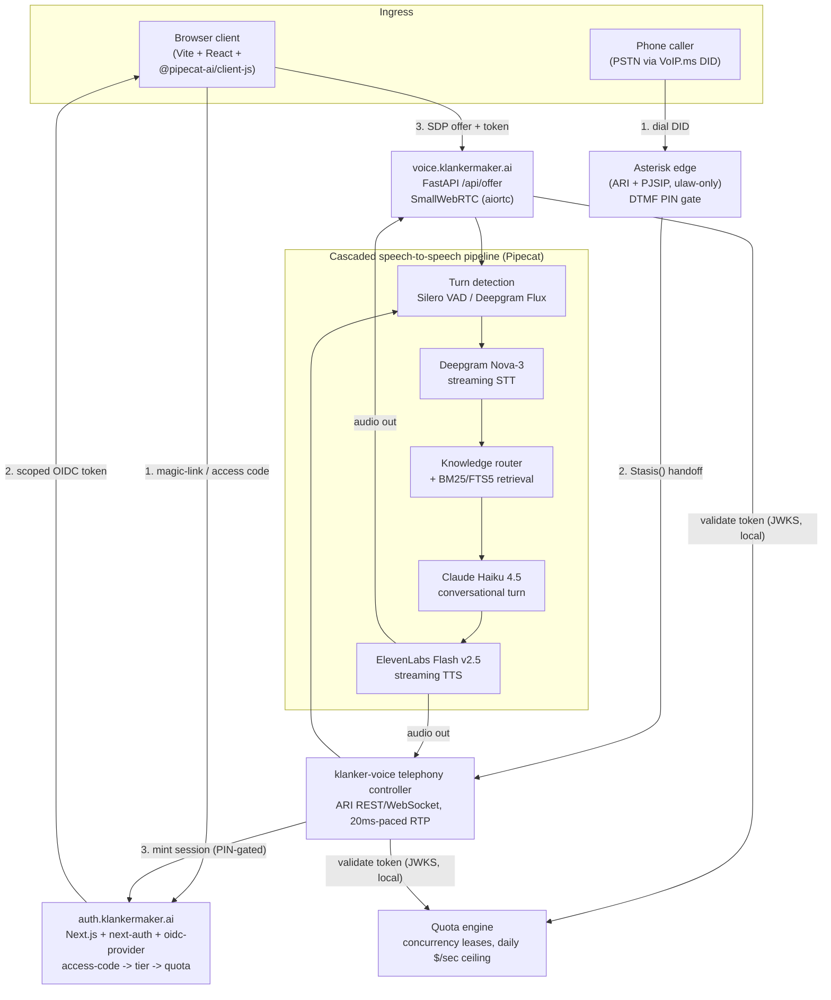

<!-- generated-by: gsd-doc-writer -->
# Klanker Voice (`kv`)

**A conference-ready, public speech-to-speech voice agent — tap a mic (or dial a real phone number) and hold a natural, low-latency conversation with the KlankerMaker concierge.**

> Live at **voice.klankermaker.ai**, and reachable from any phone — landline, cell, or a payphone at DEF CON — through real PSTN numbers routed via VoIP.ms. Same agent, same knowledge, two front doors.

Klanker Voice is a cascaded speech-to-speech pipeline (voice activity detection → speech-to-text → LLM → text-to-speech) built on [Pipecat](https://github.com/pipecat-ai/pipecat), fronted by two ingress paths — a browser WebRTC client and a real telephony edge — and gated by a purpose-built magic-link/OIDC identity service with an access-code → tier → quota system. Everything is operated through `kv`, a Go CLI sibling to [klanker-maker](https://github.com/whereiskurt/klanker-maker)'s `km`.

The agent it fronts — "KPH" — knows Kurt Hundeck, the [klanker platform](https://github.com/whereiskurt/klanker-maker), [defcon.run](https://defcon.run), and his other repos, and answers with real retrieval against a curated knowledge corpus instead of guessing. The whole point is that the conversation *feels* slick: sub-1.5s voice-to-voice, natural barge-in, full-duplex turn-taking, and an instant pre-rendered greeting the moment you tap the mic — the kind of demo that makes people say "whoa" in the first ten seconds.

---

## What Klanker Voice Is

There are four useful frames for it:

**1. The pipeline.** A cascaded (not end-to-end) speech-to-speech stack: Silero VAD or Deepgram Flux for turn detection, Deepgram Nova-3 for streaming STT, Claude Haiku 4.5 for the conversational turn, ElevenLabs Flash v2.5 for streaming TTS over WebSocket. Every stage streams — nothing waits for a full utterance before starting the next stage. The whole thing is one `pipeline.toml` away from an A/B arm swap (STT provider, turn strategy, LLM model, TTS voice).

**2. The two front doors.** A browser client (Vite + React + `@pipecat-ai/client-js`) negotiates a SmallWebRTC session directly with the voice service — no per-minute transport bill. A parallel telephony edge (local-dev and cloud Asterisk, ARI-driven, PJSIP) answers real VoIP.ms DIDs, gates the call behind a silent DTMF PIN, and feeds the identical pipeline over 20ms-paced RTP. Same agent, same knowledge, same quota system, two very different audio paths.

**3. The gate.** Nobody talks to the concierge for free or forever. A ported, self-hosted OIDC identity service (`auth.klankermaker.ai` — Next.js, `next-auth` v5, an embedded `oidc-provider` issuer, ElectroDB/DynamoDB) mints scoped access tokens off a magic-link or an access-code redemption. The voice service validates those tokens locally via JWKS (no per-session round trip) and enforces a concurrency-lease + daily-quota system with a site-wide dollar/second kill-switch, because a public mic wired to metered STT/LLM/TTS APIs is a budget risk by construction.

**4. The knowledge.** KPH isn't a bare system prompt. A curated per-topic manifest, a keyword/alias router, and a local BM25/FTS5 retrieval index inject relevant chunks into the conversation only when the topic calls for it — a stable cached style layer plus swappable per-topic packs, tuned to stay under Claude's prompt-cache floor.

---

## Parts Inventory

The bill of materials, grouped by where each piece lives in the repo.

### Voice pipeline — `apps/voice/`

| Component | Role | Where | Why chosen |
|---|---|---|---|
| [Pipecat](https://github.com/pipecat-ai/pipecat) `~=1.5.0` | Pipeline framework (VAD → STT → LLM → TTS orchestration, frame processors) | `apps/voice/pyproject.toml`, `apps/voice/bot.py` | Current post-1.0 stable line; Silero VAD and ElevenLabs WS TTS are core deps, no extras needed |
| Silero VAD / Deepgram Flux | Turn detection (`[turn].strategy` / `[stt.provider]`) | `apps/voice/pipeline.toml` | Zero-install VAD standard in Pipecat core; Flux is an A/B'd alternative with model-integrated end-of-turn detection |
| Deepgram Nova-3 (`deepgram-sdk` 7.4.0) | Streaming STT | `apps/voice/pipeline.toml` (`[stt]`) | ~300ms partials, built-in endpointing, committed baseline (Flux is the A/B challenger) |
| Claude Haiku 4.5 (`anthropic` SDK 0.116.0) | Conversational LLM turn | `apps/voice/pipeline.toml` (`[llm]`), `apps/voice/prompts/concierge.md` | Fastest/cheapest Anthropic tier — right latency/cost point for a conversational turn loop |
| ElevenLabs Flash v2.5 | Streaming TTS over WebSocket | `apps/voice/pipeline.toml` (`[tts]`) | ~75ms first-audio; ElevenLabs' own default for real-time agents |
| SmallWebRTC / aiortc 1.14.0 | Browser↔service WebRTC transport | `apps/voice/server.py` | $0/min direct-to-service transport, no Daily/LiveKit infra cost |
| FastAPI 0.139.0 / uvicorn 0.50.0 | `/api/offer` signaling + health endpoints | `apps/voice/server.py` | Pulled by Pipecat's `runner` extra; standard Pipecat signaling shape |
| PyJWT `~=2.13.0` (`[crypto]`) | Local OIDC access-token validation (JWKS) | `apps/voice/src/klanker_voice/` | Verify-only against `auth.klankermaker.ai` with no per-session round trip |
| BM25/FTS5 local retrieval | Knowledge chunk retrieval, keyless, in-process | `apps/voice/knowledge/index/`, `apps/voice/src/klanker_voice/knowledge/` | Committed per-topic chunk index, no external vector DB dependency |
| pytest 9.x / pytest-asyncio | Test suite | `apps/voice/tests/` | Async-native pipeline needs async-native tests |

### Browser client — `apps/voice/client/`

| Component | Role | Where | Why chosen |
|---|---|---|---|
| Vite 8 + TypeScript + React 19 | SPA build, served as static assets by the voice FastAPI service | `apps/voice/client/vite.config.ts`, `package.json` | Bespoke SPA, no framework overhead for a single mic-button page |
| `@pipecat-ai/client-js` 1.12.0 | Browser RTVI client — mic capture, transport lifecycle, transcript/bot-speaking events | `apps/voice/client/src/` | Official Pipecat browser SDK, versioned independently from the transport package |
| `@pipecat-ai/small-webrtc-transport` 1.10.5 | Browser↔service WebRTC transport, POSTs SDP offer to `/api/offer` | `apps/voice/client/src/` | Pairs 1:1 with the server-side `SmallWebRTCTransport` |
| Vitest 4 + Testing Library | Component/unit tests | `apps/voice/client/vitest.setup.ts` | Matches the Vite toolchain |

### Telephony edge — `apps/voice/asterisk/`, `apps/voice/src/klanker_voice/telephony/`

| Component | Role | Where | Why chosen |
|---|---|---|---|
| VoIP.ms | DID provisioning, PSTN termination | `docs/operators/voipms-provisioning-runbook.md` | Payphone-friendly real phone numbers, cheap per-minute PSTN without owning a SIP trunk relationship |
| Asterisk (ARI, PJSIP, ulaw-only) | Answers inbound SIP, runs the `Stasis()` dialplan handoff | `apps/voice/asterisk/` (`ari.conf`, `pjsip.conf`, `extensions.conf`) | Battle-tested open-source PBX; ARI hands call control to our own controller instead of Asterisk's dialplan scripting |
| `klanker-voice` telephony controller | ARI REST/WebSocket client, 20ms-paced RTP media bridge into the pipeline | `apps/voice/src/klanker_voice/telephony/` | Custom controller keeps RTP pacing and PIN-gating logic in Python next to the rest of the pipeline, not buried in Asterisk config |
| DTMF access PIN | Silent answer-gate before a caller reaches the agent | `docs/operators/voipms-provisioning-runbook.md` (§24) | Keeps the metered pipeline off of cold-call/robocall traffic on a public DID |

### Auth service — `apps/auth/webapp/`

| Component | Role | Where | Why chosen |
|---|---|---|---|
| Next.js 16.1.6 | App Router auth application | `apps/auth/webapp/next.config.ts` | Current stable line; a deliberate port of the `run.auth` service from defcon.run |
| `next-auth` 5.0.0-beta.30 (exact pin) | Magic-link email authentication | `apps/auth/webapp/package.json` | v5 beta is the only line that works with the App Router; proven in production at DEF CON via `run.auth` |
| `oidc-provider` 9.6.0 | Embedded OIDC issuer | `apps/auth/webapp/package.json` | Self-hosted issuer minting the scoped tokens the voice service validates |
| ElectroDB 3.5.3 + `@auth/dynamodb-adapter` 2.11.1 | DynamoDB single-table modeling for sessions/access-codes/tiers/usage | `apps/auth/webapp/package.json` | Ported pattern from `run.auth`; access-code → tier → quota entities fit ElectroDB's single-table model |
| Altcha 2.3.0 | Login captcha | `apps/auth/webapp/package.json` | Ported unchanged from `run.auth` |
| nodemailer 7 + AWS SES | Magic-link email delivery | `apps/auth/webapp/package.json` | Ported unchanged from `run.auth` |

### Operator CLI — `kv/`

| Component | Role | Where | Why chosen |
|---|---|---|---|
| Go 1.26 | Toolchain | `kv/go.mod` | Current stable line |
| `spf13/cobra` v1.10.2 | Command tree | `kv/go.mod`, `kv/cmd/` | Matches `km`'s command structure so the two CLIs stay structurally identical |
| `aws-sdk-go-v2` v1.42.1 (+ `dynamodb`) | Access-code CRUD, usage inspection, session visibility | `kv/internal/` | Only maintained AWS SDK line for Go |

### Infrastructure — `infra/`

| Component | Role | Where | Why chosen |
|---|---|---|---|
| Terraform + Terragrunt | IaC, matching `defcon.run.34` conventions | `infra/terraform/modules/`, `infra/terraform/live/site/` | Reuse-heavy port of proven infra; avoids reinventing per-region/per-service wiring |
| Fargate (ECS) | Runs the voice service, auth webapp, and telephony edge as containers | `infra/terraform/modules/ecs-cluster/`, `ecs-service/`, `ecs-task/`, `.github/workflows/deploy.yml` | No servers to patch; per-service task definitions match the three deployable apps |
| CloudFront + S3 | Static asset delivery / edge cutover for the browser client | `infra/terraform/modules/cloudfront/`, `cloudfront-assets/`, `infra/terraform/live/site/global/cloudfront/` | Full-front CDN cutover for the SPA and pre-rendered greeting/ambience audio |
| SOPS → SSM SecureString | Secrets for Deepgram/Anthropic/ElevenLabs/VoIP.ms/Asterisk keys, auth signing keys | `.sops.yaml`, `infra/terraform/modules/secrets/` | Proven `defcon.run.34` pattern; containers consume secrets via `valueFrom`, never baked into images |
| GitHub Actions (OIDC to AWS) | CI: build/push images, terragrunt plan/apply, gitleaks scan, ECS deploy | `.github/workflows/` | Keyless AWS auth via `github-oidc` module; no long-lived CI credentials |

---

## Architecture

Both ingress paths converge on the same pipeline; the auth service and quota engine gate every session regardless of which door the caller walked in through.



---

## Latency Budget

Every pipeline stage streams — nothing waits for a full utterance before starting the next stage.

| Stage | Target contribution |
|---|---|
| Turn detection (VAD / Flux end-of-turn) | sub-300ms |
| Deepgram Nova-3 STT (partials) | ~300ms to first partial |
| Claude Haiku 4.5 (time-to-first-token) | dominant cost — the un-knobbable floor |
| ElevenLabs Flash v2.5 (first audio byte) | ~75ms |
| **Voice-to-voice target** | **≤1.2s** (current measured baseline ~1.4s p50; ack-masking and further tuning are active work — see `docs/TUNING.md`) |

---

## Repo Map

```
apps/
  voice/            the pipeline service (bot.py, server.py, console.py)
    client/          Vite + React browser SPA
    asterisk/         local/cloud Asterisk dev edge (ARI, PJSIP, docker-compose)
    knowledge/         manifest, router, per-topic packs, style layer, BM25 index
    prompts/           concierge system prompt
    scenarios/         eval-harness YAML scenarios (barge-in, greeting, knowledge, retrieval)
    src/klanker_voice/ Python package: harness, telephony, knowledge
    configs/           A/B arm configs + telephony/voice2 variant configs
    tests/             pytest suite
  auth/
    webapp/           Next.js OIDC identity service (magic-link, access-code -> tier -> quota)
kv/                   Go CLI: access-code CRUD, usage/session visibility, deploy helpers
infra/
  terraform/          Terraform + Terragrunt: modules/ + live/site/ (region, global, services)
docs/                 architecture, dataflows, guides, techniques, operator runbooks, design specs
```

---

## Documentation

Deeper documentation lives under `docs/` (these pages also seed a future GitHub wiki):

- [`docs/architecture/overview.md`](docs/architecture/overview.md) — full system architecture
- [`docs/dataflows/browser-webrtc.md`](docs/dataflows/browser-webrtc.md) — browser mic → WebRTC → pipeline path
- [`docs/dataflows/telephony-voipms.md`](docs/dataflows/telephony-voipms.md) — PSTN → VoIP.ms → Asterisk → RTP path
- [`docs/dataflows/conversation-loop.md`](docs/dataflows/conversation-loop.md) — the VAD → STT → LLM → TTS turn loop
- [`docs/dataflows/auth-quota.md`](docs/dataflows/auth-quota.md) — magic-link/OIDC, access-code → tier → quota
- [`docs/dataflows/knowledge-retrieval.md`](docs/dataflows/knowledge-retrieval.md) — router + BM25/FTS5 retrieval
- [`docs/techniques/highlights.md`](docs/techniques/highlights.md) — the slick tricks, in detail
- [`docs/guides/getting-started.md`](docs/guides/getting-started.md) — full local setup
- [`docs/guides/development.md`](docs/guides/development.md) — dev workflow, build/lint/test commands
- [`docs/guides/configuration.md`](docs/guides/configuration.md) — `pipeline.toml`, env vars, A/B arms
- [`docs/guides/deployment.md`](docs/guides/deployment.md) — Fargate/CloudFront deploy
- [`docs/guides/testing.md`](docs/guides/testing.md) — pytest + eval-scenario harness
- [`docs/TUNING.md`](docs/TUNING.md) — endpointing A/B tuning verdicts
- [`docs/operators/`](docs/operators/) — operator runbooks (VoIP.ms provisioning, seed data)
- [`docs/superpowers/specs/`](docs/superpowers/specs/) — design history; the authoritative spec is [`2026-07-04-klanker-voice-design.md`](docs/superpowers/specs/2026-07-04-klanker-voice-design.md)

---

## Quickstart (lite)

The short version — see [`docs/guides/getting-started.md`](docs/guides/getting-started.md) for the real thing (secrets, telephony edge, auth service).

```bash
# Voice pipeline (Python 3.12, uv)
cd apps/voice
make env                          # pull provider API keys from SSM into .env (D-10)
uv sync
make voice1-local                 # http://localhost:7860

# Browser client (separate terminal)
cd apps/voice/client
npm install
npm run dev
```

---

## Highlight Reel

A few of the slick tricks worth reading about — each links into the docs above:

- **Instant greeting, zero cold-start** — the first thing you hear on tap is one hand-spliced, pre-rendered clip, not a live TTS round trip. See [`docs/techniques/highlights.md`](docs/techniques/highlights.md).
- **Ack-masking retrieval latency** — a spoken acknowledgment covers the knowledge-router/retrieval lookup so the pause never feels like a pause. See [`docs/dataflows/knowledge-retrieval.md`](docs/dataflows/knowledge-retrieval.md).
- **Full-duplex backchannel vs. interruption classification** — "mm-hmm" doesn't barge in; a real interruption does. See [`docs/techniques/highlights.md`](docs/techniques/highlights.md).
- **20ms-paced RTP clock for PSTN audio** — fixed the telephony garble; real phone calls sound as clean as the browser. See [`docs/dataflows/telephony-voipms.md`](docs/dataflows/telephony-voipms.md).
- **Per-topic ambience beds** — a subtle conference or coffee-shop bed under the voice, reconciled per topic. See [`docs/techniques/highlights.md`](docs/techniques/highlights.md).
- **Hidden "greenhouse" recruiting mode** — a keyword unlocks a sticky, first-person interview persona with real résumé context. See [`docs/dataflows/conversation-loop.md`](docs/dataflows/conversation-loop.md).

---

## License & Project Status

Klanker Voice is the personal project of **Kurt Hundeck**, released under the [MIT License](LICENSE).

It is **not** affiliated with, endorsed by, or sponsored by any current or past employer of the author, and it is **not** a commercial product or supported service. The software is provided **AS IS, without warranty of any kind** — see [LICENSE](LICENSE) and [NOTICE.md](NOTICE.md) for the full disclaimer.

| Document | Purpose |
|---|---|
| [LICENSE](LICENSE) | MIT License — the legal terms under which this code is shared |
| [NOTICE.md](NOTICE.md) | Personal-project authorship, no employer affiliation, use-at-your-own-risk |
| [.github/SECURITY.md](.github/SECURITY.md) | How to report security vulnerabilities |
| [.github/CONTRIBUTING.md](.github/CONTRIBUTING.md) | Contribution process and sign-off terms |
| [.github/CODE_OF_CONDUCT.md](.github/CODE_OF_CONDUCT.md) | Behavioral expectations for issues, PRs, and discussions |

Klanker Voice runs a public microphone wired to metered third-party APIs and grants scoped access via a real OIDC identity service. If you deploy your own copy, you accept full responsibility for everything it does on your bill, your network, and your data.
