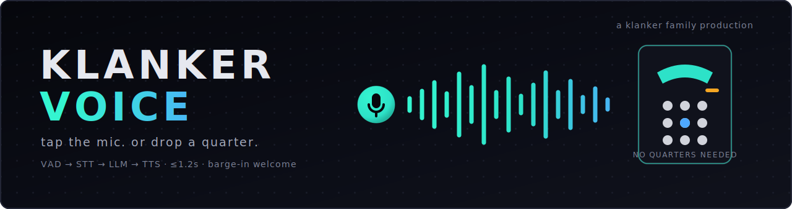

<p align="center">
  
</p>

# Klanker Voice (`kv`)

**Tap a mic — or dial a real phone number — and have a real conversation with an AI concierge that actually knows its stuff.**

Live at **[voice.klankermaker.ai](https://voice.klankermaker.ai)**. Also answering real PSTN numbers, so it works from your cell, your landline, or a payphone at DEF CON. Same agent, same knowledge, two front doors — and it's fast enough that people go *"whoa"* in the first ten seconds: instant greeting on tap, sub-1.5s replies, and you can interrupt it mid-sentence like a person.

Under the hood it's a cascaded speech-to-speech pipeline — **Silero VAD → Deepgram Nova-3 → Claude Haiku 4.5 → ElevenLabs Flash v2.5** — built on [Pipecat](https://github.com/pipecat-ai/pipecat), where every stage streams and nothing waits for a full sentence. A magic-link/OIDC gate with access codes, tiers, and quotas keeps the public mic from becoming a public bill.

> 📖 **Full documentation lives in the [Klanker Voice Wiki](https://github.com/whereiskurt/klanker-voice/wiki)** — architecture, every data flow (browser WebRTC, PSTN telephony, the conversation loop, auth & quotas, knowledge retrieval), the latency tricks, and all the guides.

---

## The Parts

The headline bill of materials — the [full parts inventory](https://github.com/whereiskurt/klanker-voice/wiki/Home#parts-inventory) is on the wiki.

| Part | What it does | Why this one |
|---|---|---|
| [Pipecat](https://github.com/pipecat-ai/pipecat) `1.5` | The pipeline — frame-by-frame VAD → STT → LLM → TTS | Post-1.0 stable, streams every stage |
| Deepgram Nova-3 | Streaming speech-to-text | ~300ms partials, built-in endpointing (Flux is the A/B challenger) |
| Claude Haiku 4.5 | The conversational brain | Fastest Anthropic tier — the right latency/cost point for a turn loop |
| ElevenLabs Flash v2.5 | Streaming text-to-speech | ~75ms first audio over WebSocket |
| SmallWebRTC (aiortc) | Browser ↔ service audio | Direct-to-service, $0/min transport |
| VoIP.ms + Asterisk (ARI) | The phone door — real DIDs into the same pipeline | Payphone-friendly PSTN, 20ms-paced RTP, DTMF PIN gate |
| Next.js + `oidc-provider` | auth.klankermaker.ai — magic links, access codes → tiers → quotas | Ported from `run.auth`, proven at DEF CON |
| Go `kv` CLI | Operator controls: codes, usage, sessions, kill-switch | Structural twin of `km` |
| Terraform/Terragrunt + Fargate + CloudFront | The metal | Reuses battle-tested `defcon.run` infra patterns |

## The Tricks

Why it *feels* fast — each one has a full write-up on the [Techniques](https://github.com/whereiskurt/klanker-voice/wiki/Techniques) page:

- **Instant greeting** — the first thing you hear is a hand-spliced pre-rendered clip, not a TTS round trip
- **Ack masking** — a spoken acknowledgment covers the knowledge-retrieval pause so it never feels like a pause
- **Backchannel-aware barge-in** — "mm-hmm" doesn't interrupt; "wait, actually—" does
- **20ms RTP pacing** — the fix that made phone calls sound as clean as the browser
- **Topic-routed knowledge** — a BM25 index and per-topic packs, so the agent retrieves instead of guessing

## The Klanker Family

| | Project | What it is |
|---|---|---|
| 🏭 | [**Klanker Maker**](https://github.com/whereiskurt/klanker-maker) (`km`) | An agent runtime on your own AWS account — eBPF-enforced sandboxes with hard budgets |
| 📞 | [**Klanker Voice**](https://github.com/whereiskurt/klanker-voice) (`kv`) | The voice — a public speech-to-speech concierge you can literally call |

Same author, same AWS-native DNA, sibling CLIs. The concierge ("KPH") knows Kurt, the klanker platform, [defcon.run](https://defcon.run), and the rest of the repo family — ask it.

## Quickstart

```bash
cd apps/voice
make env            # pull provider keys from SSM into .env
uv sync
make voice1-local   # pipeline at http://localhost:7860

cd client && npm install && npm run dev   # browser client, separate terminal
```

The real setup (secrets, auth service, telephony edge) is in [Getting Started](https://github.com/whereiskurt/klanker-voice/wiki/Getting-Started). Deep-dive sources live in [`docs/`](docs/) — the wiki is generated from them via [`scripts/sync-wiki.py`](scripts/sync-wiki.py).

## License & Status

A personal project of **Kurt Hundeck** — [MIT](LICENSE), no warranty, no employer affiliation ([NOTICE.md](NOTICE.md)). Contributions welcome under [CONTRIBUTING.md](.github/CONTRIBUTING.md); security reports per [SECURITY.md](.github/SECURITY.md).

It runs a public microphone wired to metered APIs. If you deploy your own, everything it does on your bill is yours.
