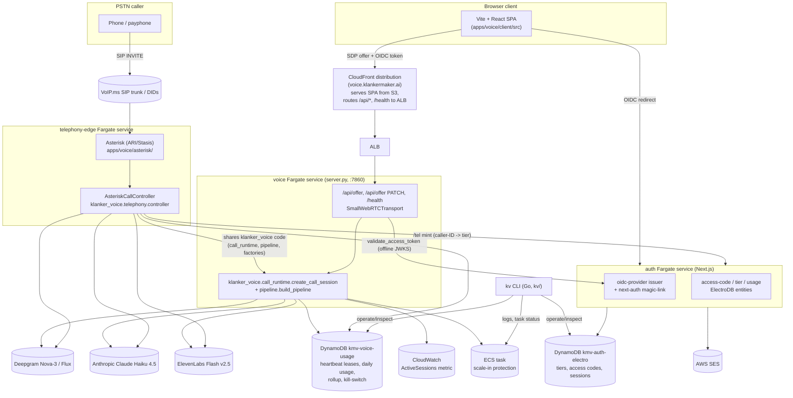
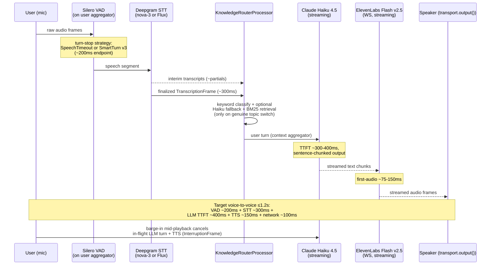

<!-- generated-by: gsd-doc-writer -->
# klanker-voice — Architecture Overview

klanker-voice is a public, conference-ready speech-to-speech voice agent (the
"KlankerMaker concierge") reachable two ways: a browser at
**voice.klankermaker.ai** over WebRTC, and a PSTN phone call routed through a
self-hosted Asterisk edge. Both paths converge on the same cascaded pipeline
(VAD → STT → LLM → TTS) and the same quota-gated session runtime; access is
issued by a separate OIDC identity service at **auth.klankermaker.ai**.

This page gives the system-wide picture. For deep dives on individual flows,
see:

- `docs/dataflows/browser-webrtc.md` — SmallWebRTC signaling, ICE, session start
- `docs/dataflows/telephony-voipms.md` — VoIP.ms → Asterisk → ARI call flow
- `docs/dataflows/conversation-loop.md` — the turn-by-turn cascade in detail
- `docs/dataflows/auth-quota.md` — OIDC tokens, tiers, and the quota gate
- `docs/dataflows/knowledge-retrieval.md` — topic routing and BM25 retrieval
- `docs/techniques/highlights.md` — notable implementation techniques

A hand-drawn system diagram also lives at
`docs/architecture/klanker-voice-architecture.excalidraw`.

## System context

Three independently deployable services run on AWS Fargate under the
`kmv` (klanker-voice) Terragrunt site, plus a Go operator CLI and a browser
single-page app:

| Service | Source | Runtime | Public entry |
|---|---|---|---|
| **voice** | `apps/voice/` | Python 3.12, FastAPI (`server.py`), Pipecat 1.5.0 | `voice.klankermaker.ai` via CloudFront (SPA + ALB API proxy) |
| **auth** | `apps/auth/webapp/` | Next.js 16, embedded `oidc-provider`, next-auth v5 magic-link | `auth.klankermaker.ai` |
| **telephony-edge** | `apps/voice/asterisk/` + `klanker_voice.telephony` | Asterisk (ARI/Stasis) + the standalone `AsteriskCallController` process, in one container | No load balancer — private ARI only, public IP solely for the outbound VoIP.ms SIP registration trunk |

Operators drive the platform with the `kv` Go CLI (`kv/`, Cobra-based:
`kv/internal/app/cmd/{code,tier,usage,killswitch,knowledge,smoke,voipms}.go`)
against SSM, DynamoDB, and ECS.

External providers: **Deepgram** (STT), **Anthropic** (LLM), **ElevenLabs**
(TTS), **VoIP.ms** (inbound DIDs / outbound SIP trunk), **AWS SES** (magic-link
email). All are metered — quota gating exists specifically because a public
mic is wired to billed APIs (see `docs/dataflows/auth-quota.md`).

## One conversational turn

Every stage of the cascade streams — this is the ≤1.2s voice-to-voice latency
budget's central constraint. The sequence below is the same for both
channels; the browser path is shown (`klanker_voice.pipeline.build_pipeline`,
`apps/voice/src/klanker_voice/pipeline.py`).

`klanker_voice.factories.build_stt/build_llm/build_tts` build the concrete
Pipecat services from `pipeline.toml`; `build_user_aggregator_params`
enforces a strict turn-strategy matrix so a misconfigured STT/turn-detector
pairing (e.g. Deepgram Flux combined with a local VAD strategy) fails at
build time rather than silently double-endpointing.

## Process and concurrency model

**Browser (WebRTC).** `server.py`'s `POST /api/offer` validates the bearer
token (`klanker_voice.auth.validate_access_token`, offline JWKS check against
`auth.klankermaker.ai`), then calls `quota.start_gate` (race-safe DynamoDB
heartbeat-lease acquisition) before any `SmallWebRTCConnection` is created.
On success, `klanker_voice.call_runtime.create_call_session` builds one
`CallSession` — a `SessionLifecycle` (service timer, 15s accounting tick,
ECS scale-in protection) wrapping a `PipelineWorker` running the assembled
`Pipeline`. Each session's task and connection are held in module-level
`SESSIONS`/`SESSION_TASKS` dicts keyed by the WebRTC `pc_id`, so an abrupt
disconnect (tab close, reload) can release its quota slot immediately rather
than waiting out the transport's own disconnect handler.

**Telephony (PSTN).** `klanker_voice.telephony.controller.AsteriskCallController`
runs in its own process (the `telephony-edge` container), consuming Asterisk
ARI events over a hand-rolled `aiohttp` client (`klanker_voice.telephony.ari.AriClient`).
On `StasisStart` it binds a UDP `SocketRtpMediaSession` *before* asking
Asterisk to create the External Media channel (must-bind-first, since
Asterisk always dials out to the app), wires a `TelephonyTransport` (RTP
PCMU ↔ pipecat audio frames, resampled once per direction at the 8kHz
boundary), and calls the **same** `create_call_session` the browser path
uses — with `channel="pstn"`. This is the deliberate shared-core seam: only
`server.py`/`webrtc.py` (browser) and `telephony/controller.py`/`transport.py`
(PSTN) are channel-specific; `call_runtime.py`, `pipeline.py`, `factories.py`,
and `session.py` are transport-neutral and never branch on channel.

A telephony call additionally passes through a **silent answer-gate**
(`klanker_voice.telephony.gate.GateProcessor`, inserted right after STT):
the pipeline runs with a zeroed `bypass_accounting=True` `GateResult`
placeholder — so speech is transcribed but no LLM/TTS/billing happens — until
the caller proves access via a spoken 4-word passphrase or a DTMF PIN.
`SessionLifecycle.upgrade_from_bypass` then promotes the same lifecycle
object into a real metered session and the greeting fires for the first time,
at unlock, not at answer.

**Per-task capacity.** `session.active_session_count()` is a process-local
counter; `quota.start_gate`'s `per_task_max_sessions` (5, per `pipeline.toml`
`[quota]`) rejects with a retryable `at-capacity` error before ever touching
DynamoDB concurrency state. ECS task-level scale-in protection is toggled on
the 0↔1 transition of that same counter (`SessionLifecycle._reconcile_scale_in_protection`),
so a task mid-conversation is never recycled by a rolling deploy.

## Key architectural decisions

| Decision | What | Why |
|---|---|---|
| Cascaded pipeline over speech-to-speech APIs | Pipecat VAD→STT→LLM→TTS, every stage streaming (`pipeline.build_pipeline`) | Avoids single-vendor lock-in (OpenAI Realtime / Gemini Live style APIs); each stage is independently swappable via `factories.py`'s `(kind, provider) -> builder` registry |
| Config-driven provider swap | `pipeline.toml` `[stt]/[llm]/[tts]`, validated by `config.py`'s allowlists | STT/LLM/TTS can be A/B'd (e.g. Deepgram Nova-3 vs Flux, `configs/voice2.toml`) with zero code changes; `config.py` rejects any TOML field that looks like credential material — keys only ever come from env/SSM |
| SmallWebRTC, direct browser↔task | `webrtc.py` self-advertises the Fargate task's own public IP as a host ICE candidate (Fargate's 1:1 NAT) instead of relying on a TURN/SFU vendor | Zero per-minute transport cost, in Pipecat's own barge-in/echo-cancellation path; explicitly no TURN fallback (documented limitation for UDP-blocked networks) |
| Shared transport-neutral call runtime | `call_runtime.create_call_session` is the one constructor both `server.py` (WebRTC) and `telephony/controller.py` (PSTN) call | A telephony bug can't take down the browser service and vice versa (separate processes), while pipeline/quota/session logic isn't duplicated |
| Heartbeat-lease concurrency, not an atomic counter | `quota.acquire_heartbeat`/`renew_heartbeat`/`release_heartbeat` — one DynamoDB item per active session with a TTL `expiresAt` | Self-heals a crashed task's slot with **no reaper process**; an atomic per-user counter was considered and rejected because it can't self-heal without one |
| Two-block cached system prompt | `knowledge.prompt_assembly.build_system_blocks` — block0 (persona + Kurt style layer, stable, `cache_control`-cacheable) + block1 (per-topic deep pack, swapped by the router) | Anthropic prompt caching needs a stable prefix ≥ a minimum token floor (`cache_floor = 4096`); pipecat's own `LLMContext` system-message path can't carry cache-control markers, so the system prompt is set directly on the LLM service's `Settings.system_instruction` instead |
| Keyword-first topic routing + same-vendor fallback | `knowledge.router.KnowledgeRouterProcessor.classify` (weighted keyword match, confidence floor) falls back to a Haiku classification call, never a 4th vendor | Deterministic and cheap in the common case; the ack line masks the fallback call's latency; the router never guesses below the confidence floor |
| §24 silent telephony answer-gate | `telephony.gate.GateProcessor` — no greeting/LLM/TTS until DTMF PIN or passphrase unlock | A public phone number must not run billed STT/LLM/TTS for an unauthenticated caller; fail-closed on gate-window expiry or a post-unlock quota rejection |
| Thin-token, tier-in-DB architecture | JWT carries only `tier_id`; `quota.read_tier` resolves session/period/concurrency limits from the auth service's DynamoDB tiers table at session start | Editing a tier's limits never requires re-issuing tokens |

## Cross-links

- **Auth and quota mechanics** (OIDC token contract, access codes, kill-switch,
  spoken wind-down): `docs/dataflows/auth-quota.md`
- **Browser WebRTC session start**: `docs/dataflows/browser-webrtc.md`
- **PSTN call flow through Asterisk/ARI**: `docs/dataflows/telephony-voipms.md`
- **The cascade in turn-by-turn detail** (duplex/backchannel handling,
  interruption, turn strategies): `docs/dataflows/conversation-loop.md`
- **Topic routing and local BM25 retrieval**: `docs/dataflows/knowledge-retrieval.md`
- **Notable implementation techniques** (RTP pacing fix, public-IP ICE
  self-advertisement, prompt caching, greeting hand-splice): `docs/techniques/highlights.md`
