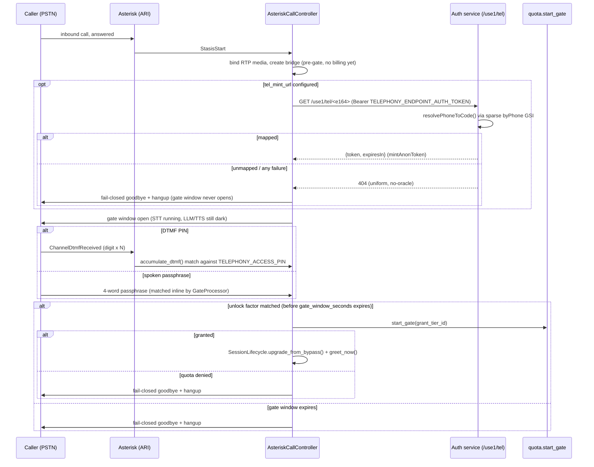

<!-- generated-by: gsd-doc-writer -->
# Data Flow: Auth, Access Codes & Quotas

klanker-voice exposes a public microphone wired to metered, per-second-billed
APIs (Deepgram STT, Claude Haiku, ElevenLabs TTS). Every one of those seconds
costs real money, so nothing reaches the pipeline until a session is
identified and admitted against a budget. This page traces the two identity
paths (magic-link login and the anonymous bypass/PSTN paths), the token the
voice service trusts, and the quota machinery that turns a granted tier into
a hard ceiling on concurrency, session length, and daily spend.

## Why this exists: the economic rationale

The project runs on a fixed monthly budget (~$120-165/mo conference-ready,
~$85/mo off-season — see `.claude/CLAUDE.md`), dominated by per-minute STT,
per-token LLM, and per-character TTS costs. A public "tap a mic button and
talk" demo has no natural rate limit unless one is built in. The design
answers that with three independent backstops:

1. **Per-tier limits** (`sessionMaxSeconds`, `periodMaxSeconds`,
   `maxConcurrent`) bound any one user's spend.
2. **A site-wide daily rollup with an auto-trip kill-switch**
   (`UsageControl`/`UsageRollup` in
   `apps/auth/webapp/src/entities/usage.ts`) bounds the *whole site's* spend
   regardless of how many users show up.
3. **A per-task concurrency cap** (`per_task_max_sessions`, checked in
   `quota.start_gate`, `apps/voice/src/klanker_voice/quota.py:441`) bounds
   how many simultaneous metered pipelines one ECS task will run, independent
   of the per-user limits.

The JWT the voice service validates is deliberately thin — it carries only
`tier_id` and `group`, never the actual limits (see "Thin token, tiers table
is truth" below). That decouples "who is allowed in" (the auth service's
job) from "how much are they allowed to use" (the voice service's job,
re-read from DynamoDB at session start), so tuning a tier's numbers never
requires re-issuing tokens.

## Identity model: access codes, tiers, and users

Everything is anchored in the auth service's DynamoDB table
(`kmv-auth-electro`), modeled with ElectroDB entities in
`apps/auth/webapp/src/entities/`:

| Entity | File | Purpose |
|---|---|---|
| `AccessCode` | `access-code.ts` | Operator-managed invite code: carries a `tierId`, optional `group`, optional `expiresAt`, optional `maxRedemptions`/`redemptionCount`. Also the anchor for the bypass and phone-mint sparse indexes. |
| `Tier` | `tier.ts` | The actual limits: `sessionMaxSeconds`, `periodMaxSeconds`, `maxConcurrent`. This is the single source of truth the voice service reads — never the JWT. |
| `CodeRedemption` | `code-redemption.ts` | One item per `(code, userId)` pair, written with a conditional `create()` so `AccessCode.redemptionCount` only increments on a genuinely new unique-user redemption (not repeat logins). |
| `AuthProfile` | `auth-profile.ts` | The Auth.js user record, extended with `activeTierId`/`activeGroup` — the login→token bridge. **Latest-wins**: entering a different code on a later login overwrites both fields; this is deliberately not a sticky per-user tier. |
| `LoginIntent` | `login-intent.ts` | A short-lived, email-keyed record written at `POST /api/login` (code entered before the user's identity/userId is known yet), consumed once the magic-link click resolves a real `userId`. |

`AccessCode` carries two additional **sparse** GSIs beyond the normal
code lookup and `kv code list` index:

- `byBypassToken` (gsi2, keyed on `bypassToken`) — only codes with
  `bypassEnabled=true` and a `bypassToken` set are indexed here. Powers the
  `/use1/join/<token>` anonymous auto-login route.
- `byPhone` (gsi3, keyed on a `normalizeE164`-canonical `phone`) — only
  codes with `phoneEnabled=true` and a `phone` set are indexed here. Powers
  the internal-only `/use1/tel/<e164>` PSTN caller-ID mint route.

Both indexes are sparse by construction (ElectroDB omits the GSI key
attributes when the optional composite is `undefined`), so a code with no
bypass/phone configured simply never appears in those lookups.

## Two access paths into the same tier model

### Path A: magic-link login (browser, `POST /api/login`)

1. The user enters an email and (optionally) an access code on the
   voice.klankermaker.ai login page.
2. `resolveAccessCode()` (`access-code.ts:185`) normalizes the code
   (trim + lowercase) and resolves it to a `{ tierId, group }` pair.
   Blank, unknown, expired, or at-redemption-cap codes **all** resolve to
   the same `no-access` tier — there is no oracle distinguishing "unknown"
   from "expired" from "capped" (`NO_ACCESS_TIER_ID`).
3. That resolution is stashed in a `LoginIntent` item keyed by the
   normalized email, because at this point no `userId` exists yet for a
   brand-new user.
4. Auth.js/next-auth (`5.0.0-beta.31`) sends the magic-link email via SES.
5. On click-through, the Auth.js `jwt()` callback calls
   `applyLoginIntentBridge()` (`config/login-intent-bridge.ts:23`) — now
   that a real `userId` is known, it stamps `activeTierId`/`activeGroup`
   onto the user's `AuthProfile` (`setActiveTier`), and — only if the intent
   carried a `code` — attempts a conditional `CodeRedemption.create()` and
   increments `AccessCode.redemptionCount` exactly once per unique user.
6. The now-authenticated browser drives an OAuth 2.0 authorization-code +
   PKCE exchange against the embedded `oidc-provider` (v9.8.6) issuer. The
   voice SPA is registered as a single **public** client (no secret,
   `token_endpoint_auth_method: "none"`, PKCE forced) in
   `apps/auth/webapp/src/config/oidc.ts:35`.
7. `extraTokenClaims` (`config/oidc.ts:388`) stamps the ACCESS token (not
   the ID token) with two namespaced claims, read fresh from the user's
   `AuthProfile` at token-mint time:
   - `https://klankermaker.ai/tier_id`
   - `https://klankermaker.ai/group`
8. The token is a **resource-indicator JWT** (`resourceIndicators`
   feature), RS256-signed, audienced to `config.oidc.voiceAudience`
   (`https://voice.klankermaker.ai`), published at the provider's `/jwks`
   route.

### Path B: bypass `/join` auto-login (anonymous, shareable URL)

Per `docs/superpowers/specs/2026-07-10-bypass-join-login-design.md`: an
operator-generated per-code URL (`kv code bypass <code>`) lets someone join
with **no email step at all**.

1. `GET https://auth.klankermaker.ai/use1/join/<bypassToken>`
   (`apps/auth/webapp/src/app/join/[token]/route.ts:33`).
2. `resolveBypassToken()` queries the sparse `byBypassToken` GSI. Every
   failure mode (unknown token, `bypassEnabled=false`, expired code) returns
   `null` uniformly, so the route always answers with the same minimal 404 —
   no token-enumeration oracle. `maxRedemptions` is **not** enforced here:
   a bypass join is an anonymous per-visit session, not a unique-user
   redemption.
3. On success, `mintAnonToken()` (`apps/auth/webapp/src/lib/bypass-token.ts`)
   signs a JWT directly with the provider's own private signing key
   (loaded from `OIDC_JWKS`), byte-compatible with a normal PKCE-issued
   token — same issuer, audience, `kid`, and the same two namespaced
   `tier_id`/`group` claims. The only difference is the subject:
   `anon:<code>:<uuid>`.
4. The route 302-redirects to `https://voice.<domain>/callback#access_token=<jwt>&token_type=bearer&expires_in=3600&anon=1` —
   the token rides in the URL **fragment**, deliberately, because fragments
   are never sent to the server and are stripped from `Referer` headers, so
   the bearer credential never lands in an access log.
5. `res.headers.set("cache-control", "no-store")` — a fresh token is minted
   on every visit; the redirect itself must never be cached by CDN and
   replayed to a different visitor.
6. The voice service's `auth.py` validates this token **exactly the same
   way** as a PKCE-issued one — no code path is aware bypass exists.

### Path C: PSTN caller-ID mint (internal-only, telephony)

Covered fully in the sequence diagram below and in `docs/dataflows/telephony-voipms.md`.
The same `mintAnonToken()` helper is reused verbatim by
`apps/auth/webapp/src/app/tel/[e164]/route.ts`, gated by
`resolvePhoneToCode()` against the sparse `byPhone` GSI, with an optional
shared-bearer defense-in-depth check (`TELEPHONY_ENDPOINT_AUTH_TOKEN`) since
this route is never meant to be internet-exposed.

## Token validation: offline, no per-session round-trip

`apps/voice/src/klanker_voice/auth.py` validates every bearer token
**fully offline** — one JWKS fetch per process (cached via
`PyJWKClient`, `_jwk_client()` at `auth.py:83`), then local RS256
signature + issuer/audience/exp checks. There is no network call to the
auth service on the hot path.

```python
DEFAULT_ISSUER = "https://auth.klankermaker.ai/use1/api/oidc"
DEFAULT_JWKS_URI = "https://auth.klankermaker.ai/use1/api/oidc/jwks"
DEFAULT_AUDIENCE = "https://voice.klankermaker.ai"

TIER_ID_CLAIM = "https://klankermaker.ai/tier_id"
GROUP_CLAIM = "https://klankermaker.ai/group"
```

`validate_access_token()` (`auth.py:107`) returns a `SessionIdentity(sub,
tier_id, group, bypass_accounting)`. A separate, constant-time-compared
`KMV_SMOKE_SERVICE_TOKEN` short-circuits the whole JWKS path for the
deployed smoke test, marking the session `bypass_accounting=True` — an
explicit, never-implicit quota-free seam (`SMOKE_SERVICE_SUB =
"service:smoke"`).

## Thin token, tiers table is truth

The JWT carries only `tier_id`/`group` — never `sessionMaxSeconds`,
`periodMaxSeconds`, or `maxConcurrent`. At session start, the voice service
reads those limits fresh from the auth service's own `Tier` items
(`quota.read_tier()`, `apps/voice/src/klanker_voice/quota.py:214`), keyed
`tier#${tierId}`/`tier#`. An unknown or tampered `tier_id` fails closed to a
zeroed `Tier(session_max_seconds=0, ...)` rather than raising — the caller's
`session_max_seconds <= 0` check then turns that into the same typed
`no-access` rejection as an explicit no-access grant, uniformly.

## Quota enforcement: the concurrency slot and the start gate

`quota.start_gate()` (`quota.py:441`) is the single enforcement seam that
every `POST /api/offer` (browser) and PSTN gate-unlock call passes through,
in this fixed order:

1. **Bypass short-circuit** — a `bypass_accounting=True` identity (smoke
   token) returns a zeroed placeholder grant immediately, no DynamoDB reads.
2. **Site-paused** — the kill-switch control item
   (`quota.read_control_item()`) is checked first; if engaged, every
   caller is rejected regardless of their own tier.
3. **No-access** — `tier.session_max_seconds <= 0`.
4. **At-capacity** (retryable) — this ECS task's own live session count
   (`active_session_count`, an in-process counter in `session.py`) against
   `per_task_max_sessions`. This is a per-*task* cap, independent of the
   per-user concurrency limit below.
5. **Concurrency-limit** — `count_active_heartbeats(user_id)` (a
   strongly-consistent DynamoDB `Query`) against `tier.max_concurrent`.
6. **Daily-limit** — `remaining_daily_seconds(user_id, tier)` against a
   configurable sub-floor.
7. Only after all five checks pass: `acquire_heartbeat()` — a **conditional**
   `PutItem` that succeeds if the session's lease item doesn't exist yet, or
   the prior lease at that key has already expired (self-healing re-acquire
   of a crashed session's slot, with no reaper process).

### The concurrency slot is a heartbeat lease, not a counter

Each active session is one `UsageHeartbeat` item
(`pk="session#${userId}"`, `sk="heartbeat#${sessionId}"`) with an
`expiresAt` TTL attribute. `count_active_heartbeats()` counts items whose
`expiresAt > now` — DynamoDB's own TTL sweep is the backstop, not the
counting mechanism (belt and suspenders). This design was chosen
specifically because the task-role IAM grants only `GetItem`/`PutItem`/
`UpdateItem`/`Query` — no `DeleteItem`, no `TransactWriteItems` — so an
atomic per-user counter that could self-heal after a crashed task was
rejected as infeasible without a reaper process (which the design
explicitly disallows).

### The concurrency-slot-leak fix: immediate release, no reaper needed

A real production bug (documented in the code and this project's memory)
was a slot that stayed "leaked" until TTL expiry if a caller hung up during
narrow async windows. The fix, now the shipped behavior in
`apps/voice/src/klanker_voice/session.py`, is:

- `SessionLifecycle.release()` (`session.py:247`) is the **single
  idempotent teardown path** every layer (wall-clock cutoff, silence
  watchdog, reconnect-grace expiry, pipeline stall, or an explicit terminal
  connection-close handler) funnels through. A synchronous
  check-and-set guard (`if self._stopped: return`) means only the first of
  any number of racing callers does anything.
- On release, `quota.release_heartbeat()` (`quota.py:295`) doesn't call
  `DeleteItem` (the task role can't) — it sets `expiresAt` to one second in
  the past, an immediate logical expiry. The very next
  `count_active_heartbeats()` call (strongly consistent) no longer counts
  it.
- `SessionLifecycle.start()` (`session.py:168`) explicitly re-checks
  `self._stopped` **after** its own `await` points, because a terminal
  connection-close event firing during those same awaits can race the
  lifecycle's own startup — without that guard, `start()` could re-acquire
  (renew) the very heartbeat `release()` just freed, reintroducing the leak.
- The result: a slot is released the instant a session actually ends, not
  after its TTL lease expires — no user is ever blocked from reconnecting
  by their own just-ended session.

The same `release()` also drives ECS task-scale-in protection
(`_reconcile_scale_in_protection`, `session.py:436`), reconciled against the
*live* session count rather than a captured pre-await flag, for the same
race-safety reason.

## Failure modes and what the user experiences

`QuotaError` (`quota.py:88`) is a typed rejection with a fixed,
non-sensitive message and an HTTP status the browser client maps to a
friendly page:

| `error_type` | HTTP status | Retryable | Meaning | User sees |
|---|---|---|---|---|
| `no-access` | 403 | No | Tier has `session_max_seconds <= 0` (unknown code, expired token claim, or genuinely no-access tier). | "Your tier does not permit voice sessions." |
| `concurrency-limit` | 403 | No | User already has `tier.max_concurrent` active sessions. | "You have reached your concurrent session limit." |
| `daily-limit` | 403 | No | Remaining daily seconds below the configured sub-floor. | "Daily usage limit reached; resets tomorrow." |
| `site-paused` | 403 | No | The kill-switch control item is engaged (manual `kv killswitch on`, or the D-09 auto-trip). | "Voice service is temporarily paused by the operator." |
| `at-capacity` | 503 | **Yes** | This ECS task's own concurrent-session count is at `per_task_max_sessions`. | A transient "please retry" — the client is expected to retry shortly (a different task may have room, or this one may free up). |

Two additional pre-gate failure modes, both handled in `auth.py` before
`quota.start_gate` is ever called:

- **Expired or invalid token** — `AuthError` is raised by
  `validate_access_token()` (bad signature, wrong issuer/audience, expired
  `exp`, or an unrecognized `kid`). The request never reaches the quota
  gate at all; the client is redirected back to login.
- **Missing credential** — an empty/absent bearer token raises
  `AuthError("missing credential")` immediately.

The site-wide **auto-trip kill-switch** (D-09/D-10) is checked and flipped
inside `quota.record_tick()` (`quota.py:360`), called every 15 seconds per
active session: once the day's rolled-up `totalSeconds` or `estCost`
crosses `auto_trip_ceiling_seconds`/`auto_trip_ceiling_dollars`, a
conditional `UpdateItem` engages the `UsageControl` item (idempotent — only
the first crossing actually flips it). Every subsequent `start_gate` call,
site-wide, then rejects with `site-paused` until an operator runs
`kv killswitch off`.

## PSTN callers: PIN/passphrase gate, then the same tier model

PSTN calls (via the Asterisk ARI edge, `apps/voice/src/klanker_voice/telephony/`)
are gated in two layers that compose:

1. **§24 silent answer-gate** (`telephony/gate.py`) — a caller must prove
   they're a real, invited human before the LLM/TTS ever engage at all,
   independent of the quota system. `GateProcessor` sits inline in the
   pipeline right after STT; while locked, it never forwards
   `TranscriptionFrame`/speaking-state frames downstream — this is the
   structural redaction boundary, not a delayed filter. Unlock is either:
   - a spoken 4-word passphrase (`TELEPHONY_PASSPHRASE_WORDS`), matched via
     order-independent token-set membership (`match_passphrase()`), or
   - a DTMF PIN (`TELEPHONY_ACCESS_PIN`) delivered as ARI
     `ChannelDtmfReceived` events (one digit per event,
     `accumulate_dtmf()` keeps a trailing-window buffer so extra digits
     before/after the real PIN still match), compared entirely outside the
     pipeline/LLM.
   - `gate_mode` (`"dtmf"` | `"passphrase"` | `"either"`) controls which
     factor(s) are accepted.
   - A `gate_window_seconds` fail-closed timer tears the call down with a
     deterministic goodbye if neither factor arrives in time.
2. **§23 caller-ID mint** (optional, `telephony_cfg.tel_mint_url`) — before
   the gate window even opens, the controller calls the internal `/tel`
   mint route with the caller's normalized E.164 number. On success, the
   caller is granted **their own entitled tier** (resolved via the
   `byPhone` sparse GSI), not a generic fallback. On any mint failure
   (unmapped number, no caller ID, timeout, bad token), the gate window
   **never opens** — the call fails closed immediately, so an unmapped
   caller never reaches `quota.start_gate` and is never billable at all.
   When `tel_mint_url` is unconfigured, every gated call instead grants
   the static `telephony_cfg.unlock_tier_id` fallback (legacy/dev
   behavior).

Only after a gate factor succeeds does `_gate_unlock()`
(`telephony/controller.py:718`) call the real `quota.start_gate()` and
promote the call's placeholder `SessionLifecycle` via
`upgrade_from_bypass()` — the LLM/TTS never engage, and no metered second
is ever billed, for a caller who never gets past the gate.

## Sequence: browser join (magic-link or bypass) to an admitted session

```mermaid
sequenceDiagram
    participant B as Browser (voice.klankermaker.ai)
    participant A as Auth service (auth.klankermaker.ai)
    participant DB as DynamoDB (kmv-auth-electro)
    participant V as Voice service (/api/offer)
    participant U as Usage table (kmv-voice-usage)

    alt Magic-link login
        B->>A: POST /api/login {email, code?}
        A->>DB: resolveAccessCode(code) -> {tierId, group}
        A->>DB: write LoginIntent (email-keyed)
        A-->>B: magic-link email sent (SES)
        B->>A: click magic-link
        A->>DB: applyLoginIntentBridge(userId, email)
        A->>DB: setActiveTier(userId) + CodeRedemption.create (once/user)
        B->>A: OIDC authorize+PKCE, then /token
        A->>A: extraTokenClaims: stamp tier_id/group onto ACCESS token
        A-->>B: RS256 JWT (aud=voice.klankermaker.ai)
    else Bypass /join auto-login
        B->>A: GET /use1/join/<bypassToken>
        A->>DB: resolveBypassToken() via sparse byBypassToken GSI
        A->>A: mintAnonToken() (sub=anon:<code>:<uuid>)
        A-->>B: 302 -> /callback#access_token=<jwt>&anon=1 (no-store)
    end

    B->>V: POST /api/offer, Authorization: Bearer <jwt>
    V->>V: auth.validate_access_token() (offline, PyJWKClient cache)
    V->>DB: quota.read_tier(tier_id)
    V->>U: quota.start_gate(): control check, at-capacity, count_active_heartbeats
    alt gate passes
        V->>U: acquire_heartbeat() (conditional PutItem)
        V-->>B: WebRTC answer; session admitted
        loop every 15s
            V->>U: quota.record_tick(): renew heartbeat, accumulate seconds, rollup, auto-trip check
        end
        B->>V: connection closes (any reason)
        V->>U: SessionLifecycle.release() -> release_heartbeat() (immediate expiry)
    else gate rejects
        V-->>B: QuotaError (no-access / concurrency-limit / daily-limit / site-paused / at-capacity)
    end
```

## Sequence: PSTN PIN/passphrase gate



## Operator tooling (`kv` CLI)

The Go `kv` CLI (`kv/internal/app/cmd/`) manages this whole model without
touching the running services:

- `kv code create <code>` / `kv code list` / `kv code expire <code>` —
  access-code CRUD.
- `kv code bypass <code>` — mints/enables the per-code bypass token behind
  `/use1/join/<token>`.
- `kv code phone <code> --add <e164>` — maps a caller ID to a code for the
  PSTN mint path.
- `kv tier define <tierId>` / `kv tier list` — define/inspect
  `sessionMaxSeconds`/`periodMaxSeconds`/`maxConcurrent` per tier.
- `kv usage today` / `kv usage history <user-id>` — read the daily/rollup
  usage items.
- `kv killswitch status` / `kv killswitch on` / `kv killswitch off` —
  manually engage/disengage the site-wide kill-switch (the same
  `UsageControl` item the D-09 auto-trip flips).
- `kv voipms ...` — VoIP.ms trunk/DID management (balance, DID routing,
  capabilities, subaccounts); see `docs/dataflows/telephony-voipms.md`.

The `kv` CLI writes DynamoDB items directly (not through the Next.js app),
which is why every entity file above documents its exact key template —
`kv` and the ElectroDB entities must reproduce the same `pk`/`sk` strings
byte-for-byte.

## Related pages

- `docs/dataflows/browser-webrtc.md` — what happens after `/api/offer`
  admits a session: the WebRTC/SmallWebRTC signaling and media path.
- `docs/dataflows/telephony-voipms.md` — the full PSTN edge: VoIP.ms trunk,
  Asterisk ARI, RTP media, and the controller's call lifecycle beyond the
  gate covered here.
- `docs/architecture/overview.md` — system-level component map.
