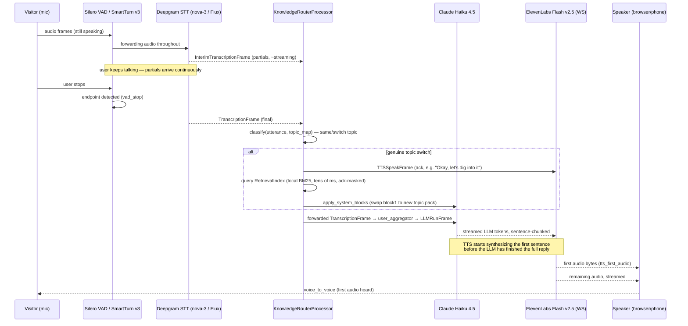

<!-- generated-by: gsd-doc-writer -->
# Data Flow: The Conversation Loop (VAD → STT → LLM → TTS)

This page walks one conversational turn through klanker-voice's cascaded pipeline — from
the moment the visitor stops talking to the moment they hear the first word back — and
explains how the pipeline keeps that gap short by overlapping every stage instead of
running them one after another.

The pipeline is assembled in `apps/voice/src/klanker_voice/pipeline.py` (`build_pipeline`),
which wires together a fixed processor chain:

```
transport.input() → [RTVIProcessor] → stt → [GateProcessor] → [DuplexController]
  → KnowledgeRouterProcessor → user_aggregator → llm → tts → transport.output()
  → assistant_aggregator
```

The bracketed stages are conditional: `RTVIProcessor` only exists when a browser client is
attached, `GateProcessor` only exists on the telephony path (see below), and
`DuplexController` only exists in the `voice2` variant. Every processor sits in this exact
order for every session — see `apps/voice/src/klanker_voice/pipeline.py:153-183`.

## Service construction

`apps/voice/src/klanker_voice/factories.py` builds the three cascade services from
`pipeline.toml`, one builder per `(kind, provider)` pair in its `BUILDERS` registry:

- **STT** — `DeepgramSTTService` (provider `deepgram-nova3`, model `nova-3-general` by
  default) or `DeepgramFluxSTTService` (provider `deepgram-flux`, used by the `voice2`
  variant's `configs/voice2.toml`). Built in `_build_stt_deepgram_nova3` /
  `_build_stt_deepgram_flux`.
- **LLM** — `AnthropicLLMService` pinned to `claude-haiku-4-5` (`_build_llm_anthropic`).
  The pipecat 1.5.0 library default is a Sonnet-tier model, so the config override is
  mandatory, not optional.
- **TTS** — `ElevenLabsTTSService`, model `eleven_flash_v2_5`, connected over the
  ElevenLabs WebSocket API for streaming synthesis (`_build_tts_elevenlabs`). It carries
  a `PronunciationTextFilter` (see below) applied to the text right before synthesis.

### Turn-detection arms

`build_user_aggregator_params` (`apps/voice/src/klanker_voice/factories.py:163-220`)
selects one of two local turn-detection strategies, or defers to Deepgram Flux entirely:

- **`vad_timeout`** — Silero VAD (`SileroVADAnalyzer`) + an explicit
  `SpeechTimeoutUserTurnStopStrategy`, ending a turn after a fixed silence window
  (`turn.vad_stop_secs`).
- **`smart_turn_v3`** — Silero VAD + `TurnAnalyzerUserTurnStopStrategy` running
  `LocalSmartTurnAnalyzerV3`, an 8 MB int8 ONNX model that detects a *semantic*
  end-of-turn instead of waiting out a fixed timeout. This is the pipecat 1.5.0 default
  and the value shipped in `apps/voice/pipeline.toml`'s `[turn]` table.
- **Deepgram Flux arm** — when `stt.provider = "deepgram-flux"`, the factory refuses to
  set `vad_analyzer` or `user_turn_strategies` at all; Flux's service metadata installs
  its own `ExternalUserTurnStrategies` (server-side end-of-turn detection). Passing local
  strategies alongside Flux would silently double-endpoint (Flux and Silero both trying
  to decide when the user stopped), so `factories.py` raises `ValueError` if a caller
  tries.

`apps/voice/pipeline.toml`'s `[turn]` table carries `strategy = "smart_turn_v3"`,
`vad_stop_secs = 0.2`, `user_speech_timeout = 0.6` — these are the values documented and
A/B-tested in `docs/TUNING.md`, described further in the latency budget below.

## Sequence: one turn, streaming overlap

The key property that keeps voice-to-voice latency down is that no stage waits for the
previous one to fully finish before starting its own work — STT keeps transcribing while
the LLM's earlier partial output is already being spoken.



The ack-and-retrieval branch only fires on a genuine deep-turn topic switch (see
[Knowledge routing](#knowledge-routing-and-context-assembly) below) — a same-topic
follow-up or shallow one-liner skips straight to the LLM with no ack and no pack swap.

## Latency budget

Two sets of numbers exist for this pipeline: the original design-time budget from the
spec, and the measured numbers from the Phase-1 endpointing tuning round
(`docs/TUNING.md`). The measured numbers are real `UserBotLatencyObserver` clock
readings from `apps/voice/tests`/harness runs; the design-spec numbers were the
pre-implementation estimate.

| Stage | Design-spec estimate | Measured (winner: Nova-3 + SmartTurn v3, `docs/TUNING.md`) |
|---|---|---|
| VAD endpoint detect (`vad_stop`) | ~200ms | **~398–401ms p50** |
| STT finalize (`stt_final`) | ~300ms | usually `null` by design — streaming STT's TTFB lands on the first partial while the user is still speaking, before the anchor window opens |
| LLM TTFT (`llm_ttft`, Claude Haiku 4.5) | ~400ms | **~543–587ms p50**, tail to ~1400ms p95 |
| TTS first-audio (`tts_first_audio`, ElevenLabs Flash) | ~150ms | **~156–164ms p50** |
| Network / aggregation / transport | ~100ms | ~300ms (approximate, back-computed — not a directly observed stage) |
| **Total voice-to-voice** | **≤1.2s target** | **~1401.7–1460.9ms p50 / ~2080–2210ms p95** |

The measured total sits above the 1.2s design ceiling. Per `docs/TUNING.md`, this was an
explicit, recorded decision (not a silently-missed target): the three in-scope
endpointing levers were exhausted — SmartTurn v3 already reclaims ~400ms of dead air
versus fixed-timeout VAD, Deepgram Flux carries an unavoidable ~500ms
`ExternalUserTurnStopStrategy` hold on this pipecat version, and lowering `vad_stop_secs`
below 0.2 trades barge-in safety for headroom that wouldn't clear the ceiling anyway. The
dominant remaining cost is Claude Haiku 4.5's LLM TTFT, which no endpointing knob
touches. `≤1.2s` (and a stretch goal of ~800ms) is a committed later-phase goal via the
PIPE-08 ack-masking lever and further LLM-side latency work — see
`docs/techniques/highlights.md` for the ack-masking technique already shipped
(`pipeline.py:113`'s note that "the local BM25 query's cost is ack-masked" behind the
spoken topic-switch acknowledgment).

## Barge-in mechanics

**Half-duplex (`voice1`, the shipped default cascade without a `[duplex]` table):** the
instant the visitor makes any sound while the bot is speaking, the pipeline worker queues
an `InterruptionFrame` downstream through the whole chain. This frame cancels the
in-flight TTS synthesis and the in-flight LLM turn, and pipecat's own context-truncation
path trims the interrupted assistant turn out of the `LLMContext` — no custom truncation
bookkeeping lives in this codebase (see `pipeline.py`'s module docstring, "Pattern 5").
Any sound counts as a barge-in in this variant, including a passing "mm-hm".

**Full-duplex (`voice2`, `configs/voice2.toml` with `[duplex] enabled = true`):**
`apps/voice/src/klanker_voice/duplex.py`'s `DuplexController` sits between STT and the
router — the one point where an `InterruptionFrame` can be intercepted before it reaches
the aggregator/LLM/TTS. When the bot is speaking and a barge-in fires, the controller
**holds** the `InterruptionFrame` for up to `interruption_hold_ms` (250ms in
`configs/voice2.toml`) waiting for the first transcript of what the visitor just said:

- If `classify_user_speech()` (`duplex.py:69`) determines the utterance is a
  **backchannel** — non-empty, at most `max_backchannel_words` (3) words, and every word
  is in the `backchannel_words` lexicon (`yeah`, `mhm`, `okay`, `right`, `gotcha`, etc.,
  `apps/voice/src/klanker_voice/config.py:173-188`) — the held interruption is **dropped**
  (the bot keeps talking) and the backchannel's finalized transcript is swallowed so it
  never becomes a user turn.
- Anything else (a real question, "wait", "no", or a longer utterance) is an
  **interruption** — the held frame is **released** and the bot yields the floor, same as
  the half-duplex path.
- If no transcript arrives within the hold window, the fail-safe fires: the interruption
  is released unconditionally. A genuine barge-in must never be silently swallowed.

The `voice2` variant also opts into a bot-side "listening cue" emitter
(`backchannel_emitter = true`): the concierge can drop its own short "mm-hm." /"mm." while
the visitor is mid-turn, straight to TTS via `TTSSpeakFrame(append_to_context=False)`
(never entering the LLM context), rate-limited to at most one per
`emitter_min_gap_seconds` (6.0s) and only after the visitor has been talking continuously
for `emitter_min_talk_seconds` (8.0s) — never on a short turn or a pause.

## Full-duplex vs half-duplex: `variants.py`

`apps/voice/src/klanker_voice/variants.py` maps a browser-supplied `?variant=` query
string on `/api/offer` to a config file, through a fixed in-code allowlist
(`_VARIANT_CONFIGS`) so the attacker-controlled variant name can never become a
filesystem path:

| Variant | Config | STT | Turn detection | Duplex |
|---|---|---|---|---|
| `voice1` | `pipeline.toml` (default) | Deepgram Nova-3 | SmartTurn v3 (local) | off — half-duplex, any sound interrupts |
| `voice2` (**default since 2026-07-10**) | `configs/voice2.toml` | Deepgram Flux | server-side (Flux `ExternalUserTurnStrategies`) | on — `DuplexController` backchannel classifier |

An unknown or missing variant name resolves to `DEFAULT_VARIANT` (`voice2`). Everything
outside `[stt]`/`[turn]`/`[duplex]` — persona, knowledge config, TTS voice — is
deliberately identical between the two variants so they stay a clean A/B on
interactivity alone.

## Knowledge routing and context assembly

Two modules cooperate to keep the system prompt both cheap (Anthropic prompt-cacheable)
and topically fresh:

- **`apps/voice/src/klanker_voice/knowledge/prompt_assembly.py`** builds the Anthropic
  `system` array as two (or three) text blocks: **block0** is the stable, cached prefix
  (persona + Kurt STYLE layer + every topic's one-line spoken hook), wrapped with
  `cache_control: ephemeral` and byte-identical across every turn and every topic —
  `cache_floor = 4096` tokens in `pipeline.toml` is Claude Haiku 4.5's minimum cacheable
  system prefix. **block1** is the currently-selected topic's deep pack, swappable
  without touching block0. A third, uncached **block2** is appended only on a genuine
  deep-turn switch, carrying the top-`k` chunks retrieved from the local BM25/FTS5
  index. This two/three-block array is set directly on the LLM service's
  `Settings.system_instruction` rather than through pipecat's normal `LLMContext`
  system-message path, because `AnthropicLLMAdapter` flattens a list-content system
  message into one string before it reaches the API — silently dropping the
  `cache_control` marker (documented in `apply_system_blocks`'s docstring).
- **`apps/voice/src/klanker_voice/knowledge/router.py`**'s `KnowledgeRouterProcessor`
  sits between STT and the user aggregator. It classifies each finalized transcription
  against `knowledge/router/topic-map.yaml`'s weighted keyword lists
  (`classify()`); below the configured confidence floor it falls back to a same-vendor
  Haiku classification call (never a fourth LLM vendor) rather than guessing. On a
  genuine topic switch it fires one of several rotating spoken acks ("Okay, let's dig
  into {topic}…"), swaps block1 to the new topic's pack, and — on that same turn —
  queries the local retrieval index for extra chunks, so the retrieval query's latency
  is masked behind the spoken ack rather than adding its own wait.

This retrieval/router pairing is summarized here only; the deep-dive on manifest
structure, topic-map scoring, and the retrieval index itself lives in
`docs/dataflows/knowledge-retrieval.md`.

## Pronunciation normalization

`apps/voice/src/klanker_voice/pronunciation.py`'s `PronunciationTextFilter` is attached
to the ElevenLabs TTS service via `text_filters=[...]`. Pipecat applies text filters
*after* LLM text aggregation and *before* synthesis, so this rewrite only affects what is
spoken — on-screen captions (built from the raw upstream `LLMTextFrame`, before this
filter runs) still show the natural spelling. The rule table (`_RULES`) is an ordered,
word-boundary-anchored list of regex substitutions for klanker-specific proper nouns that
ElevenLabs mispronounces (e.g. `defcon.run.34` → "deaf con run thirty four", `meshtk` →
"Mesh Tee Kay", `kv` → "klanker voice"), applied longest-and-most-specific pattern first.

## Client-facing events and captions

`apps/voice/src/klanker_voice/rtvi.py` builds the `RTVIProcessor`/`RTVIObserverParams`
pair that gives the browser client transcripts, speaking-state events, and metrics with
no custom frame handling. It is placed immediately after `transport.input()` when a live
client is attached (`build_pipeline`'s `rtvi` parameter), so it observes every frame in
the cascade. `build_rtvi_observer_params()` explicitly turns on
`bot_audio_level_enabled`/`user_audio_level_enabled` (both default `False` upstream) so
the client's orb UI gets amplitude-driven deformation while either side is talking.

## Latency observation

`apps/voice/src/klanker_voice/observers.py`'s `LatencyReportObserver` subclasses
pipecat's built-in `UserBotLatencyObserver` — it does not hand-roll frame timestamps.
Per finalized turn it maps the parent's latency breakdown onto five stable stage names
(`vad_stop`, `stt_final`, `llm_ttft`, `tts_first_audio`, `voice_to_voice`), appends a
`TurnRecord` to a JSON artifact under `apps/voice/artifacts/harness/` (written
incrementally, so a hard kill still leaves data), and pushes one `kmv-latency`
`RTVIServerMessageFrame` per turn for the client's live latency HUD. This observer is
also what produced the measured numbers in the latency budget table above.

On the Deepgram Flux arm specifically, the observer needs a workaround: Flux never emits
the local `VADUserStoppedSpeakingFrame` the parent class anchors on (Flux owns
endpointing server-side), so `observers.py` seeds the anchor on Flux's own
`UserStoppedSpeakingFrame` at end-of-turn instead — keeping `vad_stop` `null` (there is no
locally observable wait to report) while still letting `voice_to_voice` measure the
post-endpointing processing latency.

## Telephony path differences

The processor chain above is shared with the PSTN/telephony path (Asterisk ARI edge,
`apps/voice/src/klanker_voice/telephony/`), with two additions gated by
`pipeline.toml`'s `[telephony]` table:

- A `GateProcessor` (`apps/voice/src/klanker_voice/telephony/gate.py`) is inserted
  immediately after `stt` and before the duplex/router stage — while locked (the §24
  silent answer-gate, PIN or spoken passphrase not yet satisfied), it never forwards a
  transcription frame downstream, so neither the duplex backchannel logic nor the
  knowledge router ever sees pre-unlock speech.
- Audio is PCMU (μ-law) at 8kHz / 20ms packetization instead of WebRTC's Opus, per
  `pipeline.toml`'s `[telephony]` `codec`/`sample_rate`/`packet_ms` values.

The full telephony call flow, gate unlock sequence, and RTP media handling are covered in
`docs/dataflows/telephony-voipms.md`.
