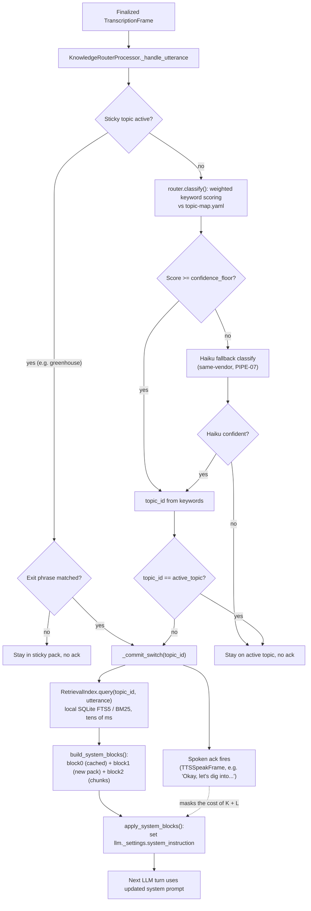

<!-- generated-by: gsd-doc-writer -->
# Data Flow: Knowledge Packs & Retrieval

How KPH (the klanker-voice concierge) knows things — the per-topic knowledge pack
system that gets curated facts and Kurt's speaking style into Claude Haiku's context
window on every turn, without adding a network hop to the ≤1.2s voice-to-voice budget.

Everything described here lives under `apps/voice/src/klanker_voice/knowledge/` (the
runtime code) and `apps/voice/knowledge/` (the data: manifest, topic packs, style
layer, retrieval index, transcripts). Related deep-dives: [Data Flow: Conversation
Loop](conversation-loop.md) for where this sits in the turn-by-turn pipeline, and
[Technique Highlights](../techniques/highlights.md) for the "ack-masking" latency
trick this system relies on.

## The shape of it: two axes, three blocks

KPH's system prompt is assembled from two independent axes of curated content:

- **Facts** — one markdown pack per topic under `apps/voice/knowledge/topics/*.md`
  (e.g. `klanker-maker.md`, `defcon-run-34.md`), each distilled from a curated
  source manifest.
- **Style** — Kurt's own speaking voice, captured once in
  `apps/voice/knowledge/style/kurt-voice.md` (and folded into it, in full, from a
  second curated file `kurt-humor-personality.md`). This is voice/personality, not
  facts, and it applies to every topic — it never gets swapped.

These are combined into a two-block (sometimes three-block) Anthropic `system` array,
built by `prompt_assembly.build_system_blocks`:

- **block0 (stable, cached):** persona + the Kurt style layer + a one-line spoken
  "hook" for every non-hidden topic. Byte-identical across topic switches and across
  turns, wrapped in `cache_control: ephemeral` so Claude's prompt cache covers it.
- **block1 (swappable, uncached):** the active topic's deep pack — the thing that
  changes when the router detects a genuine topic switch.
- **block2 (optional, uncached):** local BM25 retrieval results, appended only when
  the router found matching chunks for the current utterance.

## Turn-by-turn flow



The router (`klanker_voice.knowledge.router.KnowledgeRouterProcessor`) sits between
STT and the `LLMContextAggregatorPair` in `pipeline.build_pipeline` — every finalized
transcription passes through it before the LLM ever sees it.

Two things are worth calling out about the retrieval step specifically:

- It only fires on a **genuine deep-turn topic switch** — never on a same-topic
  follow-up or a shallow one-liner the stable prefix can already answer
  (`router.py`'s Pitfall 1/2 guards). A same-topic question never re-queries or
  re-swaps anything.
- Its cost is **ack-masked**: the BM25 query and the block rebuild happen in
  `_commit_switch` at the exact same moment the spoken acknowledgment
  ("Okay, let's dig into klanker-maker.") is queued as a `TTSSpeakFrame`. The visitor
  hears the ack while the retrieval + prompt assembly runs, so it adds no perceived
  latency (`pipeline.py` describes this as "ack-masked", ~line 114). The full
  technique writeup lives in [Technique Highlights](../techniques/highlights.md).

## Router: keyword-first classification with a same-vendor fallback

`router.classify(utterance, topic_map)` normalizes the utterance (lowercase,
punctuation stripped) and sums the weight of every keyword/alias from
`apps/voice/knowledge/router/topic-map.yaml` that appears as a substring, per topic.
The highest-scoring topic wins; if the best score is below `topic_map.confidence_floor`
(`2` in the checked-in map), the router refuses to guess and returns `None` rather than
committing to a wrong pack.

Below the floor, `KnowledgeRouterProcessor` calls
`default_haiku_fallback_classify` — a single Claude Haiku 4.5 classification call,
same vendor as the main LLM (never a fourth API, per the project's PIPE-07
convention). It's given the list of non-hidden topic ids/names and asked to reply
with exactly one id or `NONE`. Hidden topics (see Greenhouse below) are excluded from
this candidate set — they are reachable only by an exact keyword match, never by
fuzzy LLM classification, so an unrelated utterance can never accidentally land in a
hidden pack.

A topic only causes a **pack swap + ack** when it's a genuinely different, confident
topic. Every ack template ends by naming the topic's `spoken_name` and is chosen
round-robin from `DEFAULT_ACK_TEMPLATES` (or a topic-specific override) so repeat
switches don't sound canned.

## Retrieval: local BM25 over SQLite FTS5, no vector DB

`klanker_voice.knowledge.retrieval.RetrievalIndex` is deliberately keyless and
network-free:

- The engine is Python's stdlib `sqlite3` with the FTS5 extension's built-in BM25
  ranking — no embeddings, no vector database, no external ranking model.
- Corpus chunks are pre-built offline into `apps/voice/knowledge/index/{topic}/*.jsonl`
  (one JSON object per line: `text`, `source_path`, `heading`), committed to the repo
  so a human can diff them like any other content change.
- At runtime, `RetrievalIndex` builds one FTS5 table per topic **lazily**, on that
  topic's first query, and keeps the connection alive for the life of the
  session/process — never rebuilt per turn.
- A query sanitizes the raw utterance down to alphanumeric words (FTS5 operator
  characters like `"`, `-`, `(`, `NOT`, `AND` are stripped), OR-joins them, and runs
  one `MATCH` query ordered by `bm25(chunks)`.
- Results are trimmed to a token budget (`retrieval_budget`, default 1500 approx.
  tokens) and capped at `retrieval_top_k` (default 4) chunks.
- Chunking (`chunk_text`) is markdown-heading-aware: each section becomes one chunk
  (or several overlapping ~900-character windows for long sections), so a fact near a
  section boundary isn't orphaned mid-sentence.
- A topic with no built index (or a query that sanitizes to nothing) degrades to an
  empty result — retrieval is additive depth, never a hard dependency of a turn.

As of the last `make knowledge` refresh, only three topics have a built retrieval
index: `klanker-maker` (2,601 chunks — by far the largest, from km's own `docs/`
tree), `kvmlab` (19 chunks), and `tiogo` (23 chunks). `defcon-run-34` and `meshtk`
currently ship pack-only. `klanker-voice` and `greenhouse` are **deliberately**
pack-only by design — both are hand-authored, public-safe-scrubbed text, and chunking
them into a searchable index risks exposing sensitive design or résumé text outside
its curated framing.

**Why local BM25 instead of a vector DB:** no embeddings API call (no added latency
or vendor), no infrastructure to run, and the corpus is small and topic-scoped enough
that lexical matching over a few thousand chunks is fast and good enough — the whole
point is a query that costs tens of milliseconds, hidden behind the spoken ack.

## Topics

| Topic id | Spoken name | Hidden? | Sticky? | Retrieval index? |
|---|---|---|---|---|
| `klanker-maker` | klanker-maker | no | no | yes (2,601 chunks) |
| `defcon-run-34` | DEFCON dot run, thirty-four | no | no | no |
| `meshtk` | mesh T K, the meshtastic toolkit | no | no | no |
| `tiogo` | tiogo, Kurt's Tenable tool | no | no | yes (23 chunks) |
| `kvmlab` | kvmlab, Kurt's home security lab | no | no | yes (19 chunks) |
| `klanker-voice` | klanker-voice, the voice agent you're talking to | no | no | no (pack-only by design) |
| `greenhouse` | Kurt's background | **yes** | **yes** | no (pack-only by design) |

Source: `apps/voice/knowledge/router/topic-map.yaml` (keywords, hooks, hidden/sticky
flags) and `apps/voice/knowledge/manifest.yaml` (pack filenames, source provenance,
`tour_priority`). The tour order (topics KPH proactively re-pitches) is
`klanker-maker` → `defcon-run-34` → `meshtk`; `tiogo` and `kvmlab` are additive,
reachable by keyword but not part of the proactive tour.

**Attribution note (from the `defcon-run-34` pack):** the pack carries a hard rule
that DEF CON Run was *founded by AgentX*, not Kurt, and instructs KPH to lead with
that attribution on the first turn any origin/history question comes up. This is
sourced content in `apps/voice/knowledge/topics/defcon-run-34.md`, not something the
retrieval/router code enforces mechanically — it's a fact baked into the curated pack
text itself.

## Prompt assembly: why two blocks, and the cache-control constraint

`prompt_assembly.build_system_blocks(cfg, knowledge_cfg, topic, retrieved_chunks,
remaining_seconds)` builds the array described above. A few details worth knowing:

- **block0 must stay byte-identical** across every topic and every turn for the same
  session config — it's built by concatenating the persona prompt, the style file,
  and every non-hidden topic's rendered hook (`render_topic_hooks`), and it alone
  carries `cache_control: {"type": "ephemeral"}`. `knowledge_cfg.cache_floor`
  (default `4096`) documents the minimum token count Haiku 4.5 needs before its
  prompt cache actually engages on that block.
- **block1** is the swapped-in topic pack text (`knowledge/topics/{topic}.md`,
  looked up via the topic's `pack` filename in `manifest.yaml`). If
  `remaining_seconds` is supplied (a session-time pacing signal — see D-06 in the
  codebase), a short pacing note is prepended to block1 only: tight-and-close-out
  near the end of a session, or room to go deeper early on.
- **block2**, when present, renders the retrieved chunks with light source
  attribution (`### From {source_path} — {heading}`) so KPH can narrate from them
  rather than reading raw text aloud verbatim.
- There's a real pipecat wiring gotcha documented in `prompt_assembly.py`:
  `apply_system_blocks` sets the block list directly on
  `llm._settings.system_instruction` rather than going through pipecat's normal
  `LLMContext` system-message convention, because pipecat's Anthropic adapter
  flattens a list-content system message into a single string before it reaches the
  API — silently discarding the `cache_control` marker that makes the caching work.

## Content lint (advisory only, never blocking)

`klanker_voice.knowledge.lint.advisory_lint` scans generated pack/style text for
"shouldn't be said aloud on a public mic" shapes — AWS account IDs, role ARNs, AWS
access key IDs, PEM key/certificate blocks, internal hostnames, and "cloud map"
references. It is explicitly **advisory-only**: it never raises and never blocks a
write. It exists to flag findings for a human to look at during the git-diff review
step of a refresh, not to gate the corpus (which is public-by-design — Kurt curates
what goes into the manifest in the first place).

## The refresh workflow

Knowledge packs are never hand-edited in place — they're regenerated from the
manifest by `apps/voice/scripts/refresh_knowledge.py`, run via:

```bash
make -C apps/voice knowledge
```

(Also documented as the equivalent `kv knowledge refresh` dispatcher.) The script:

1. Reads `apps/voice/knowledge/manifest.yaml` — every source must be explicitly
   flagged `public: true`, hand-verified public-safe by Kurt; sources without that
   flag are excluded outright, not merely warned about.
2. Distills each topic's curated sources (docs, code, transcripts, or diagrams-as-text)
   into a pack (`survey_repo` → `distill_topic`) and runs a style pass over the
   Kurt-voice layer.
3. For code-heavy sources, there's a swappable doc-generation seam
   (`generate_docs`), but it currently defaults to a no-op — code sources are
   indexed directly, not pre-summarized into docs first.
4. Chunks the corpus with `retrieval.chunk_text` and writes
   `knowledge/index/{topic}/*.jsonl` for the topics that get a retrieval index.
5. Runs `advisory_lint` over every generated output and surfaces findings.
6. **Never auto-commits.** Output lands as an ordinary git diff under
   `apps/voice/knowledge/` for a human to review (`git diff -- apps/voice/knowledge/`)
   before it's committed — the project's D-09 review gate. This is a deliberate,
   offline, manually-triggered process; it never runs during a live session.

## The hidden "greenhouse" recruiting mode

`greenhouse` is a designed easter-egg topic, not an accident:

- It's flagged `hidden: true` in `topic-map.yaml`, which excludes it from block0's
  advertised topic hooks (`render_topic_hooks` skips hidden topics) and from the
  Haiku fallback's candidate list. The **only** way into it is an exact keyword match
  on the literal word "greenhouse" — never a fuzzy LLM classification, never
  proactively offered.
- It's flagged `sticky: true`. Once active, the router holds the floor: normal topic
  keywords mid-interview no longer switch KPH away — the router only releases when
  the utterance matches one of the topic's explicit `exit` phrases (e.g. "interview's
  over"), at which point it snaps back to the session's original topic with a
  distinct exit acknowledgment.
- Its topic-map entry sets `ack: ""`, which **suppresses** the normal spoken
  acknowledgment entirely — greenhouse's own LLM-generated opening turn (a
  first-person, "ask what role you're hiring for" response) is the sole spoken
  output, so it lands correctly in the chat transcript instead of racing a canned ack
  line in full-duplex.
- The pack itself (`apps/voice/knowledge/topics/greenhouse.md`) is hand-authored and
  public-safe-scrubbed from Kurt's résumé/LinkedIn content (`apps/voice/knowledge/
  corpus/kurt-resume.md` is the seed input, not the live pack) — like `klanker-voice`,
  it is never auto-generated from the standard refresh pipeline's distillation step
  and ships with no retrieval index, to avoid ever chunking résumé content into
  ad-hoc BM25 search results.
- On telephony (PSTN) calls specifically, the router applies an early-lock on the
  greenhouse keyword so the sticky mode takes effect within the same turn it's
  spoken, rather than waiting for a subsequent turn boundary.

This document intentionally does not reproduce any of the pack's résumé/interview
content — only the mechanism that gates and delivers it.

## See also

- [Data Flow: Conversation Loop](conversation-loop.md) — the full turn loop this
  router sits inside (STT → router → LLM → TTS), and how ack-masking fits alongside
  other latency-hiding techniques.
- [Technique Highlights](../techniques/highlights.md) — the general ack-masking
  pattern used both here and elsewhere in the pipeline.
