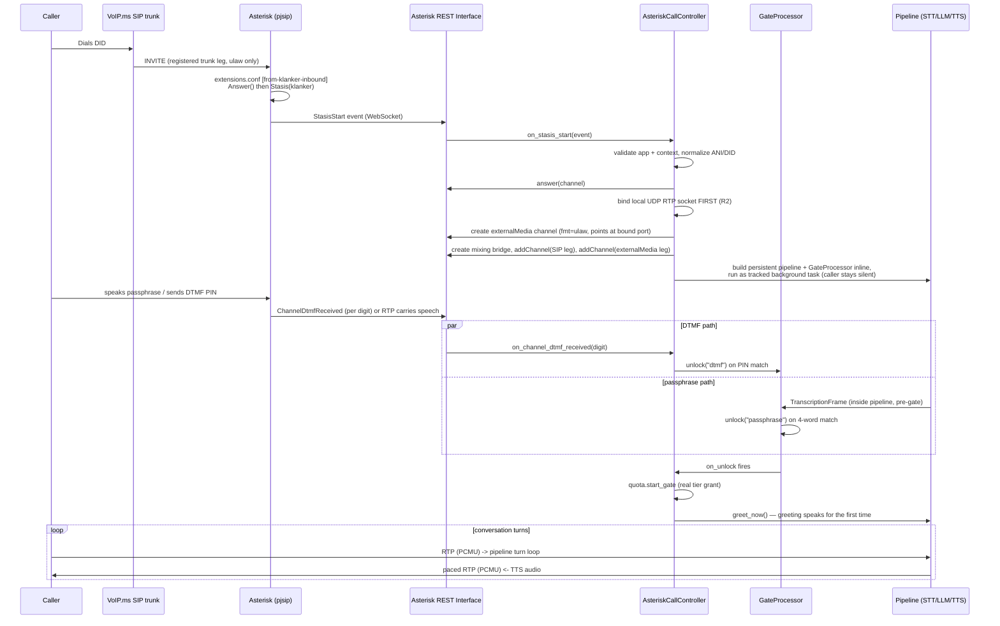

<!-- generated-by: gsd-doc-writer -->
# Data Flow: PSTN → VoIP.ms → Asterisk → Pipeline

How a call placed from an ordinary phone — a cell, a landline, a conference
payphone — reaches the same conversational agent the browser client talks
to at voice.klankermaker.ai. The telephony path reuses the shared call
runtime end to end; the only new work is a PSTN-to-pipeline media and
call-control edge (Asterisk + the Asterisk REST Interface) sitting in front
of it.

Source: `apps/voice/src/klanker_voice/telephony/` (`ari.py`, `controller.py`,
`transport.py`, `media.py`, `rtp_socket.py`, `gate.py`, `config.py`,
`types.py`, `__main__.py`), `apps/voice/src/klanker_voice/call_runtime.py`,
and `apps/voice/asterisk/` (`extensions.conf`, `pjsip.conf`, `ari.conf`).
Design intent: `docs/superpowers/specs/2026-07-11-voipms-telephony-integration.md`
(§23 caller-ID mint addendum, §24 call-answer security gate addendum).
Operator procedures: `docs/operators/voipms-provisioning-runbook.md` and
`docs/operators/phase12-seed-data.md` — this page describes the runtime data
flow, not how to provision a DID or seed a tier; see those runbooks for that.

## Sequence: dial-in to first spoken word



The externalMedia channel Asterisk creates in response to `create_external_media`
re-enters the same Stasis app as its own `StasisStart` event (Asterisk
technology `UnicastRTP`). `AsteriskCallController.on_stasis_start` recognizes
this by its `UnicastRTP`-prefixed channel name and returns immediately — it
is the media leg the controller just created, not a second inbound call.

## Call control: ARI and the channel/bridge dance

`apps/voice/src/klanker_voice/telephony/ari.py` (`AriClient`) is a
hand-rolled `aiohttp`-based ARI client — REST calls plus one long-lived
events WebSocket — deliberately avoiding third-party ARI wrapper libraries
(all were rejected: synchronous, wrong async runtime, or built on a stale
dependency). It exposes exactly the six REST calls the controller needs
(`answer`, `create_external_media`, `create_bridge`, `add_channel`,
`hangup`, `destroy_bridge`) and dispatches every event on the ARI events
WebSocket to a registered handler by `event["type"]`.

`apps/voice/src/klanker_voice/telephony/controller.py`
(`AsteriskCallController`) owns the `calls: dict[str, ActiveCall]` registry,
keyed by the original Asterisk SIP channel ID, and runs as its own
standalone process (`python -m klanker_voice.telephony.controller`, entry
point in `apps/voice/src/klanker_voice/telephony/__main__.py`) — separate
from the browser's FastAPI `server.py` process, so a telephony bug can never
take down the browser voice service or vice versa. `on_stasis_start`:

1. Rejects any channel whose Stasis app or dialplan context doesn't match
   the expected values, hanging it up with no resource allocation.
2. Answers the SIP channel.
3. Binds the local RTP socket **before** creating Asterisk's external-media
   channel — because Asterisk's `externalMedia` only supports
   `connection_type=client`, Asterisk always dials out to Klanker, so an
   unbound port would silently drop the first datagrams (UDP has no
   handshake/retry).
4. Creates the external-media channel (`format=ulaw`) pointed at the bound
   port, creates a mixing bridge, and adds both the SIP channel and the
   external-media channel to it.
5. Branches on `TelephonyConfig.require_gate` into the gated flow (default,
   production) or an ungated escape hatch (test/dev only, immediate tier
   grant with no §24 gate at all).

Every teardown path — `ChannelDestroyed`, a hard session timeout, or a
gate-window expiry — funnels through one idempotent `_close_active_call`:
`CallSession.close()` → `lifecycle.release()` exactly once, then bridge,
external-media-channel, and RTP-socket teardown, then the registry entry is
removed. A quota-denied caller (the gate passes but `quota.start_gate`
rejects, e.g. at the concurrency limit) never gets a `CallSession`
constructed at all — the bridge and external-media channel allocated for
the gate attempt are torn down immediately and the SIP channel is hung up,
so no bridge is ever left dangling for a caller who wasn't granted access.

## Audio format ladder

The wire format never changes: 8 kHz PCMU (G.711 µ-law), 20 ms packets, 160
samples per packet. The pipeline's internal rates are fixed independently of
transport (`PIPELINE_INPUT_SAMPLE_RATE = 16000`, `PIPELINE_OUTPUT_SAMPLE_RATE
= 24000` in `apps/voice/src/klanker_voice/telephony/transport.py` — these
are the same rates pipecat's own `StartFrame` defaults use, matching the
browser WebRTC path byte-for-byte). Resampling happens exactly once per
direction, at the 8 kHz boundary, using one stateful SOXR-based resampler
per direction (`clear_after_secs=None`, so telephony's irregular packet
gaps never trigger a stale-history clear):

| Stage | Component | Transform |
|---|---|---|
| Inbound wire → pipeline | `TelephonyInputTransport._receive_audio` (`transport.py`) | RTP parse (`media.parse_rtp`) → depacketize (`RtpDepacketizer`) → µ-law decode (`ulaw_decode`) → resample 8000 Hz → 16000 Hz → `InputAudioRawFrame` |
| Pipeline → outbound wire | `TelephonyOutputTransport.write_audio_frame` (`transport.py`) | resample 24000 Hz → 8000 Hz → frame into 160-sample chunks (`PcmFramer`) → µ-law encode (`ulaw_encode`) → RTP packetize (`RtpPacketizer`) |

The µ-law codec and the RFC 3550 RTP parser/packetizer are hand-implemented
in `apps/voice/src/klanker_voice/telephony/media.py` — there was no existing
raw-RTP library in the stack to reuse. `RtpDepacketizer` tolerates
duplicate, reordered, and single-missing packets: an exact-duplicate
sequence number is dropped, and exactly one missing 20 ms packet gets one
synthetic silence frame inserted so the downstream audio clock stays
aligned; larger gaps are tolerated silently without extra insertion. The
dedup window is bounded (64 entries) — never unbounded buffering.

## The RTP pacing fix: why unpaced bursts garbled every call

This was a hard-won, live-call-verified production fix, documented in full
in `.planning/debug/resolved/telephony-outbound-garble.md`.

**Symptom.** On real PSTN calls through the deployed Fargate telephony
edge, every outbound utterance (KPH speaking to the caller) was constant,
unusable garble. The inbound direction (caller speaking to KPH) was clean —
Deepgram transcribed correctly, the LLM responded, quota gating worked.
Only the return leg was broken.

**What was ruled out.** CPU starvation (a 0.5→2 vCPU bump made no
difference), network jitter/loss (the garble was constant, not periodic),
and every stage of the audio pipeline itself: an offline sine-wave
round-trip through the exact chain (SOXR resample 24000→8000, `PcmFramer`,
`ulaw_encode`, RTP packetize, decode) recovered a fidelity-perfect signal.
The bytes were always correct. Only delivery *timing* was wrong.

**Root cause.** pipecat's `BaseOutputTransport` does not pace audio itself —
it delegates real-time pacing to each transport's `write_audio_frame`
implementation. Every other pipecat transport supplies that pacing
naturally: local audio blocks on the sound device, the Daily transport
sleeps per 20 ms frame, and the WebRTC transport hands frames to a
media-clock-paced track. The original `TelephonyOutputTransport
.write_audio_frame` had none of that — it resampled, encoded, and
packetized, then called `SocketRtpMediaSession.write_packet`, which is a
non-blocking `socket.sendto()` that returns instantly. With no clock in the
loop, an entire TTS utterance's worth of RTP packets — dozens to hundreds —
was dumped to Asterisk's external-media socket in a few milliseconds
instead of one packet every 20 ms. Asterisk has no read-side jitter buffer
on a `UnicastRTP` external-media leg, so it forwarded the burst straight to
VoIP.ms and the PSTN, producing constant garble on every utterance. Inbound
audio was clean by contrast because Asterisk paces *its own* RTP
transmission on the way in.

**Fix.** `TelephonyOutputTransport` (`apps/voice/src/klanker_voice/telephony/transport.py`)
now runs a real-time send clock. Before every `media.write_packet` call,
`write_audio_frame` awaits `_pace()`, which advances a monotonic schedule by
exactly one `packet_time_ms` (20 ms) interval per packet:

```python
async def _pace(self) -> None:
    now = time.monotonic()
    if self._next_send_time is None or now > self._next_send_time + self._packet_interval:
        self._next_send_time = now
    delay = self._next_send_time - now
    if delay > 0:
        await asyncio.sleep(delay)
    self._next_send_time += self._packet_interval
```

The schedule resyncs to "now" whenever more than one interval has elapsed
since the last packet — the first packet of a call, a natural pause between
utterances, or right after a barge-in flush — so a quiet gap never turns
into a catch-up burst; it simply restarts the 20 ms cadence cleanly.
`flush()` (called on `InterruptionFrame`, i.e. a caller barge-in) drops any
buffered-but-incomplete PCM tail and resets `_next_send_time` to `None` so
the next utterance starts its own cadence fresh.

This supplies exactly the real-time back-pressure pipecat's
`BaseOutputTransport` expects from every transport, mirroring what local
audio, Daily, and WebRTC already provide natively. A dedicated regression
test asserts wall-clock inter-packet gaps land in the 20 ms range rather
than near zero, and the fix was confirmed by an actual live PSTN call
before being marked resolved.

## Gating and quota: how telephony sessions differ from browser sessions

Browser sessions authenticate through the OIDC magic-link flow before a
WebRTC offer is ever made — access is proven before the call exists. A
phone call has no such pre-flight: Asterisk answers, `Stasis(klanker)`
starts, and Klanker must decide access *after* the caller is already
connected. This is the §24 "silent answer-gate" described in
`docs/superpowers/specs/2026-07-11-voipms-telephony-integration.md`.

**The gate is inline in the pipeline, not a pre-pipeline check.**
`AsteriskCallController._finish_stasis_start_gated` builds the full,
persistent pipeline immediately — including a
`GateProcessor` (`apps/voice/src/klanker_voice/telephony/gate.py`) inserted
right after STT, before the duplex/router stage — using a zeroed,
bypass-accounting placeholder `GateResult` so no real quota accounting or
session timer starts yet. STT runs immediately so the caller's speech (and
ARI-delivered DTMF) can be observed, but the caller hears nothing: while
locked, `GateProcessor.process_frame` never forwards
`TranscriptionFrame`/`InterimTranscriptionFrame`/`UserStartedSpeakingFrame`/
`UserStoppedSpeakingFrame` downstream — this is the structural redaction
boundary. Pre-unlock speech never reaches the LLM, the transcript ledger, or
any log; only the method used to unlock (`"dtmf"` or `"passphrase"`) and the
call ID are ever logged.

**Two unlock factors, controlled by `TelephonyConfig.gate_mode`**
(`"dtmf"`, `"passphrase"`, or `"either"`, the default):

- **Spoken passphrase** — a 4-word phrase read from the
  `TELEPHONY_PASSPHRASE_WORDS` environment variable. `GateProcessor`
  tokenizes each finalized `TranscriptionFrame` and accumulates a
  lower-cased token set; when every secret word is present
  (order-independent), it unlocks itself directly.
- **DTMF PIN** — read from `TELEPHONY_ACCESS_PIN`. DTMF never touches the
  pipeline frame stream at all: ARI delivers one `ChannelDtmfReceived`
  event per digit, and `AsteriskCallController.on_channel_dtmf_received`
  accumulates a per-call digit buffer (keeping only the trailing N digits,
  so extra fat-fingered digits before or after the real PIN still match) and
  calls `gate.unlock("dtmf")` directly on an exact match — the PIN
  comparison itself never runs inside the LLM-adjacent pipeline.

**Fail-closed, always.** A `gate_window_seconds` timer (default 10s) starts
on the pipeline's first `StartFrame`. If neither factor unlocks before it
expires — or if `quota.start_gate` rejects the caller right after a
successful unlock (e.g. the concurrency limit is already at capacity) — the
call routes through `_gate_fail_closed`: a deterministic, LLM-free goodbye
(`GATE_FAIL_CLOSED_COPY`, spoken via `pipeline.speak_goodbye`, bypassing the
LLM entirely), a short grace period for it to play, then the same idempotent
`_close_active_call` teardown. There is never a silently open PSTN line.

**On unlock**, `_gate_unlock` calls the *real* `quota.start_gate`, promotes
the placeholder `SessionLifecycle` via `upgrade_from_bypass` (now real
accounting and timers begin), and calls `pipeline.greet_now` — the greeting
fires here, at the unlock boundary, not on answer. This is why a caller who
never unlocks hears nothing but silence until the fail-closed goodbye or
hangup.

**Per-caller entitlement via the `/tel` mint (§23).** When
`TelephonyConfig.tel_mint_url` is configured, the controller resolves the
caller's *own* entitled tier before the gate window even opens:
`_mint_tier_from_caller_id` normalizes the caller's ANI to E.164 and calls a
private, internal-only mint endpoint (bearer token read from the environment
variable named by `tel_mint_env_var`, never a literal), then validates the
returned token through the same offline auth path the browser uses
(`klanker_voice.auth.validate_access_token`). On success, the caller is
granted their own mapped tier at unlock instead of the generic
`unlock_tier_id`. On **any** mint failure — unmapped caller ID, no caller
ID, a non-200/timeout/network error, or a bad token — the persistent
pipeline is still built (so a TTS-capable worker exists to speak the
fail-closed goodbye), but the gate window is never started and
`quota.start_gate` is never called: an unrecognized caller is never billed
for a metered STT/LLM/TTS session, even for a few seconds of the gate
window. When `tel_mint_url` is left unconfigured (the default), this whole
step is skipped and every gated call grants the static
`unlock_tier_id` — the original Phase 11 behavior, unchanged.

**Hard session timeout still reaches the SIP channel.** A `SessionLifecycle`
timeout (or any other release trigger) is composed with an ARI hangup of
the original SIP channel before routing through `_close_active_call` — a
Klanker-side pipeline cancellation alone would leave the caller's PSTN line
silently open, still accruing carrier minutes.

## Cross-links

- [Data Flow: Conversation Loop](conversation-loop.md) — the shared STT →
  LLM → TTS turn loop this telephony path feeds into once the gate unlocks
  (identical for browser and phone callers).
- [Data Flow: Auth and Quota](auth-quota.md) — the `quota.start_gate` /
  `SessionLifecycle` machinery the §24 gate and the `/tel` mint both plug
  into.
- [Techniques: Highlights](../techniques/highlights.md) — the RTP pacing fix
  and other hard-won production fixes, in context with the rest of the
  project's notable engineering decisions.
- [Architecture Overview](../architecture/overview.md) — where the
  telephony edge fits relative to the browser WebRTC path and the shared
  call runtime.
- `docs/operators/voipms-provisioning-runbook.md` — how to order and route a
  DID, lock down the VoIP.ms account, and seed the security-group allow-list.
- `docs/operators/phase12-seed-data.md` — how tiers and phone-to-tier
  mappings are seeded for the caller-ID mint.
