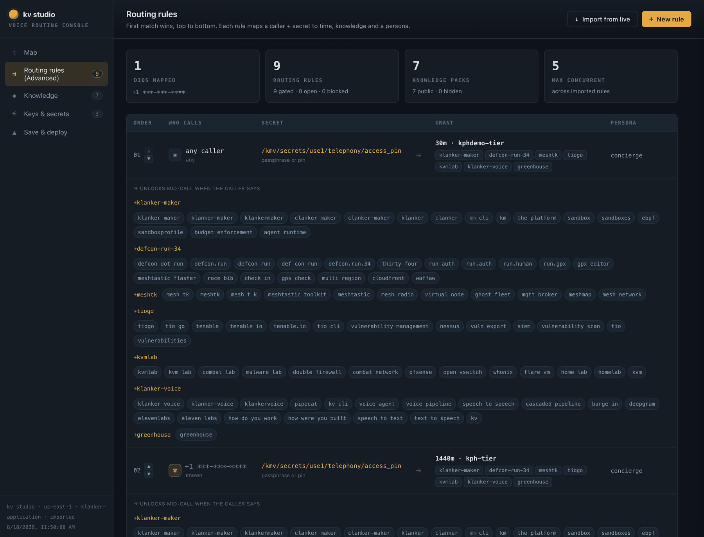

# Access codes & tiers

*"Show all the passcodes that I let you in with."*

## The short answer

```bash
kv code list     # who can get in
kv tier list     # what they get when they do
```


Two commands, because they answer two different questions. A **code** is the
string a person types. A **tier** is the time budget they get. Codes are cheap
and disposable; tiers are the actual policy, and there are only six of them.

> `kv code list` does **not** show whether a code has a bypass `/join` link or a
> caller-ID mapping. Not even with `--json` — those attributes aren't on the
> record it reads. See [the four ways in](#the-four-ways-in) below.

---

## The model

```
  a person  ──types──▶  access code  ──points at──▶  tier  ──sets──▶  session limits
                             │                                        period limits
                             │                                        concurrency
                             └── optionally also: a bypass /join link
                                                  a caller-ID phone mapping
```

A code carries no limits of its own. Everything a code "grants" it grants by
naming a tier. Two codes on the same tier are indistinguishable in effect — the
difference is only that you can expire, cap or revoke them separately, which is
exactly why you hand out different codes to different audiences.

### Codes

| Attribute | Meaning |
|---|---|
| `code` | the string typed at login (normalised — case and whitespace are not significant) |
| `tierId` | the tier this grants. **Not validated at creation time.** |
| `group` | free-text label, purely for your own organisation |
| `expiresAt` | soft expiry; past this the code resolves to no-access |
| `maxRedemptions` | cap on **unique users**, not on sessions |
| `redemptionCount` | unique users who have redeemed it so far |

### Tiers

| Tier | Session | Period | Concurrent | What it's for |
|---|---|---|---|---|
| `pstn-public-tier` | 180s | 900s | 4 | **the public phone tier** — every un-entitled caller who passes the gate |
| `pstn-baseline-tier` | 600s | 1800s | 1 | the earlier, roomier PSTN tier |
| `demo-tier` | 120s | 600s | 2 | a two-minute conference demo |
| `kphdemo-tier` | 1800s | 3600s | 2 | the general-purpose demo tier most codes point at |
| `kph-tier` | 86400s | 1000000s | 5 | the operator's own tier — effectively unmetered |
| `no-access` | 0 | 0 | 0 | explicit deny, and the uniform fallback |

**Session** bounds one conversation. **Period** bounds a rolling window across
sessions. **Concurrent** bounds simultaneous sessions for that identity.

Two of these rows are load-bearing infrastructure, not just policy:

- **`pstn-public-tier`** is named by `unlock_tier_id` in
  `configs/telephony.toml`. It is what every public caller gets after passing
  the gate. **If this row is missing, every public phone call fails closed** —
  an absent tier is treated as no-access, and nothing anywhere logs "the tier
  you referenced does not exist". It is a total phone outage that looks like a
  networking problem.
- **`no-access`** is the answer the auth app returns for *every* failure:
  unknown code, expired code, cap reached. Deliberately uniform, so the login
  form is not an oracle telling a stranger which of their guesses was a real
  code that happened to be expired.

---

## The four ways in

This is the part that `kv code list` alone will not tell you. There are four
distinct paths to a voice session, and three of them are attached to codes.

| # | Path | How it's granted | Shown by |
|---|---|---|---|
| 1 | **Type the code** | person enters it at `auth.klankermaker.ai` after a magic-link login | `kv code list` |
| 2 | **Bypass `/join` link** | a URL that auto-logs someone in, no email round trip | `kv studio` → Routing rules |
| 3 | **Caller-ID mint** | their phone number is mapped to a code; they're recognised when they dial | `kv telephony list` |
| 4 | **The phone gate** | a PSTN caller enters the DTMF PIN or says the passphrase | `kv telephony list` → Gate config |

All four converge: each mints the same shape of OIDC access token, signed with
the same key and carrying the same tier claim, which the voice service validates
locally against the published JWKS. There is no separate "bypass mode" inside
the voice service — it cannot tell these apart, and does not need to.

### 2. Bypass `/join` links

```bash
kv code bypass <code>              # enable + print the URL
kv code bypass <code> --rotate     # new token; every old link dies
kv code bypass <code> --disable    # link starts 404ing
```

The URL looks like `https://auth.klankermaker.ai/use1/join/<12-char-token>`. The
token rides to the voice app in the URL *fragment*, which is never sent to a
server and is stripped from `Referer`, so the credential stays out of access
logs.

Three things to know:

- **Re-running the bare command rotates.** `kv code bypass <code>` on a code that
  already has a link silently mints a new one and breaks every copy of the old
  URL already handed out. Use `--rotate` when that is what you mean.
- **`maxRedemptions` is not enforced on this path.** Deliberately: the cap is a
  per-unique-user counter, and a `/join` link has no user to count. A capped
  code still lets an unlimited number of people in through its bypass link.
  Expiry *is* enforced.
- **Every failure returns an identical 404.** Unknown token, disabled bypass,
  expired code — all the same response, so the endpoint gives no signal to
  someone guessing tokens.

### 3. Caller-ID mint mappings

```bash
kv code phone <code> --add "+1 (519) 555-1234"
kv code phone <code> --remove
```

The person's number is mapped to a code; when they dial in, the telephony edge
asks the auth app to mint a token for that number and they land on that code's
tier without entering anything.

Same caveat as bypass: **`maxRedemptions` is not enforced here either**, expiry
is. And the same no-oracle rule — an unmapped number and an expired code produce
the identical 404, so the endpoint cannot be used to enumerate who is enrolled.

The number is normalised to E.164 using byte-for-byte the same algorithm as the
auth app. That parity is enforced by a test, and it matters: a divergent
normalisation writes a key the resolver never looks up, and the caller simply
isn't recognised — no error, anywhere.

Audit these after every event. A mapping left in place is a standing free pass:

```bash
kv telephony list        # the Caller-ID mint mappings section
```

### 4. The phone gate

Public callers do not have a code. They pass a **gate** — a silent answer window
during which they must either key the DTMF PIN or speak the passphrase. On
unlock they are granted `unlock_tier_id`, currently `pstn-public-tier`.

```bash
kv telephony list                    # gate_mode, require_gate, window, tier
kv telephony list --show-secrets     # the PIN and passphrase themselves
```

The two gate secrets live only in SSM:

| Secret | SSM parameter |
|---|---|
| DTMF PIN | `/kmv/secrets/use1/telephony/access_pin` |
| Spoken passphrase | `/kmv/secrets/use1/telephony/passphrase_words` |

`gate_mode = "either"` means both factors are live and either one unlocks.
`gate_window_seconds = 12` is how long a caller has — measured from the *end* of
the ring-and-"hey" pickup cue, not from pipeline start, which is worth about six
extra seconds of real dialling budget.

Rotate them from studio's Keys & secrets tab, which reveals and rotates on demand
and never writes a value to browser storage:


> A caller on an **OTP-only DID** (the four game lines) never sees this gate's
> concierge factors at all — they're suppressed on those numbers, and only that
> line's own game code applies. See [phone games](phone-games-runbook.md).

---

## Common tasks

### Issue a code for an event

```bash
kv tier list                                   # pick a tier; don't invent one
kv code create dc34floor --tier kphdemo-tier \
  --group conference --max 200 \
  --expires 2026-08-12T00:00:00Z
kv code list                                   # confirm
```

Always set `--expires` for an event code. It is the difference between a code
that stops working when the conference ends and one that is still live next year
because nobody remembered it existed.

`--max` counts unique users, not sessions — `--max 200` means two hundred
different people, each able to start as many sessions as their tier's period
budget allows.

### Retire a code

```bash
kv code expire dc34floor
```

Soft expiry: the row and its `redemptionCount` survive, so you keep the history.
There is no delete and no un-expire — to revive one, create it again or set a
future `--expires`.

**If the code had a bypass link, expiring it is enough** — the `/join` route
checks expiry. But if you want the link dead immediately and unambiguously:

```bash
kv code bypass dc34floor --disable
```

### Hand out a no-typing link

```bash
kv code create demo2026 --tier demo-tier --expires 2026-09-01T00:00:00Z
kv code bypass demo2026
# -> https://auth.klankermaker.ai/use1/join/aB3xY9zQ1mNp
```

Anyone with that URL is in. Treat it as the credential it is, and prefer a short
`--expires` over trusting that a link stops circulating.

### Change what everyone gets, right now

```bash
kv tier define pstn-public-tier --session-max 120 --period-max 900 \
  --max-concurrent 4 --group pstn
```

Tier changes take effect on the next session — no deploy, no restart, no cache.
This is the fastest lever you have mid-event; shortening `--session-max` on the
public tier throttles cost immediately without turning anyone away.

> `tier define` is a **full replace**, not an update. Every flag you omit
> reverts to its default — notably `--max-concurrent`, which defaults to `1`.
> Always pass the complete set. Run `kv tier list` first and copy the row.

### Audit everything at once

```bash
kv studio
```

Studio's Routing rules tab is the only view that shows codes, their tiers, their
bypass state, their caller-ID matches and their knowledge grants together:



---

## Where it all lives

| Thing | Store | Key |
|---|---|---|
| access codes | DynamoDB `kmv-auth-electro` | `gsi1` partition `accesscodes#` |
| tiers | DynamoDB `kmv-auth-electro` | `gsi1` partition `tiers#` |
| bypass tokens | DynamoDB `kmv-auth-electro` | sparse `gsi2` |
| caller-ID mappings | DynamoDB `kmv-auth-electro` | sparse `gsi3` (`byPhone`) |
| gate PIN / passphrase | SSM SecureString | `/kmv/secrets/use1/telephony/*` |
| game DTMF codes | SSM SecureString | `/kmv/secrets/use1/ctf/announcement_*` |
| usage & kill-switch | DynamoDB `kmv-voice-usage` | *different table — `--usage-table`* |

The last row is the trap. `kv usage` and `kv killswitch` read a **different
table** from everything else on this page, selected by a **different flag**.
Pointing one at the other returns empty rather than erroring.

---

## Related

- [`kv` CLI reference](kv-cli-reference.md) — every flag on every command here
- [Phone number inventory](phone-number-inventory.md) — the other inventory
- [Phone games](phone-games-runbook.md) — the game codes, which are not access codes
- [Incident runbook](incident-runbook.md) — when to reach for the kill-switch instead
- [Auth & quotas data flow](../dataflows/auth-quota.md) — how a token becomes a metered session
