# `kv` CLI reference

Complete reference for the klanker-voice operator CLI: all 37 commands, their
real flags and defaults, what each one actually reads or writes, and what
credentials it needs.

This is the *reference*. If you have a task rather than a command in mind, start
from the [operator manual index](README.md) — the runbooks there cite the
commands below in the order you'd actually run them.

> Every example on this page was captured live on 2026-08-18 against the real
> `klanker-application` account. Secrets, access-code values and caller numbers
> are redacted; everything else is verbatim.

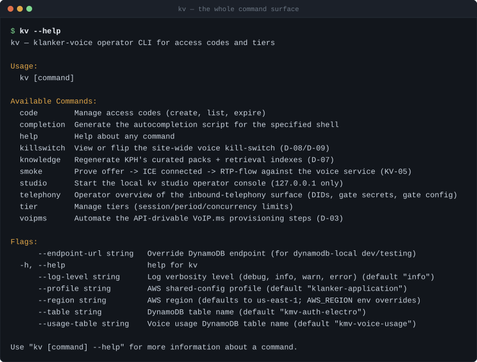

---

## Install

```bash
cd kv
make build      # -> kv/bin/kv  (gitignored)
make install    # -> $GOBIN/kv, on your PATH
make test       # go test ./...
make vet
```

`kv` is a single static Go binary. It needs no config file. Three commands do
need a **repo checkout** to work, because they read repo-relative paths:
`kv telephony list`/`calls` (the telephony TOML), `kv knowledge refresh` (the
Python refresh script), and `kv studio` (all of the studio config files). Those
resolve the repo root via `git rev-parse --show-toplevel`, so you can run them
from any subdirectory — but not from outside a checkout.

---

## Credentials

### AWS

`kv` never takes AWS keys as flags. It resolves a profile with a deliberate
do-what-I-mean precedence (`kv/internal/app/cmd/root.go`):

| Situation | Profile used |
|---|---|
| `AWS_PROFILE` is set | that profile, verbatim |
| `AWS_PROFILE` unset, `AWS_ACCESS_KEY_ID` set | **none** — pure ambient credentials, so CI runners are never hijacked by the operator default |
| neither set | `klanker-application` |

Region resolves from `AWS_REGION`, else `us-east-1`. Both are overridable per
invocation with `--profile` / `--region`; `--profile ""` explicitly forces the
ambient credential chain.

In practice, as the operator, you do this once per session and then forget it:

```bash
aws sso login --profile klanker-application
```

Every AWS-backed command fails with a credential error rather than doing
anything partial if that token has expired.

### VoIP.ms

The `voipms` commands, and the *Inbound DIDs* section of `kv telephony list`,
need VoIP.ms API credentials. They are resolved **env first, SSM second** — and
never accepted as a flag, because a flag lands in shell history and in the
process table:

1. `VOIPMS_API_USERNAME` + `VOIPMS_API_PASSWORD` from the environment, if both
   are set;
2. otherwise `/kmv/secrets/use1/voipms/api_username` and
   `/kmv/secrets/use1/voipms/api_password` from SSM, decrypted with your AWS
   profile.

So with a valid AWS session you normally need to do nothing at all.

> **The IP allow-list will bite you.** VoIP.ms rejects API calls from any IP not
> on the account's API allow-list. If your home IP is not on it you get
> `VoIP.ms rejected the call: ip_not_enabled (whitelist this IP in the VoIP.ms
> API panel)` — and `kv telephony list` will still render every other section,
> with that one line where the DID table should be. That degradation is
> deliberate: one unreachable provider must not blind you to the rest.

`kv` never prints a VoIP.ms credential, and deliberately unwraps Go's
`*url.Error` before wrapping transport failures, because that error type
stringifies the full request URL — which carries `api_password` in its query
string.

---

## The two-table trap

`kv` talks to **two different DynamoDB tables**, selected by **two different
global flags**. Point a command at the wrong one and you get an empty result or
a write into the void — not an error.

| Flag | Default | Env override | Holds | Commands that use it |
|---|---|---|---|---|
| `--table` | `kmv-auth-electro` | `AUTH_ELECTRO_DBNAME` | access codes, tiers, bypass tokens, caller-ID phone mappings | `code *`, `tier *`, `telephony list`, `studio` |
| `--usage-table` | `kmv-voice-usage` | `KMV_USAGE_TABLE` | per-user daily usage, the site-wide rollup, the kill-switch control item | `usage *`, `killswitch *` |

The defaults are correct for production, so in normal use you never pass either.
They exist for `dynamodb-local` and for a second environment. `--endpoint-url`
(or `AWS_ENDPOINT_URL_DYNAMODB`) redirects DynamoDB at a local endpoint for
testing; it affects DynamoDB only — SSM and CloudWatch have no local substitute
and always go to the real region.

---

## Global flags

Available on every command:

| Flag | Default | Purpose |
|---|---|---|
| `--profile` | `klanker-application` | AWS shared-config profile (see precedence above) |
| `--region` | `us-east-1` | AWS region |
| `--table` | `kmv-auth-electro` | access-code / tier table |
| `--usage-table` | `kmv-voice-usage` | usage / kill-switch table |
| `--endpoint-url` | *(unset)* | DynamoDB endpoint override, for `dynamodb-local` |
| `--log-level` | `info` | `debug`, `info`, `warn`, `error` |

Most read commands also take `--json`, which emits the full record set with
two-space indentation. Prefer it for anything you intend to pipe — the plain
text output is column-aligned for humans and its spacing is not a contract.

---

## Command map

Which store is authoritative for what. This is the table to read when you are
trying to remember *where a thing lives*, not how to change it.

| Command | Reads / writes | Needs |
|---|---|---|
| `code create` / `expire` / `bypass` / `phone` | DynamoDB `kmv-auth-electro` (write) | AWS |
| `code list` | DynamoDB `kmv-auth-electro` (GSI1 query) | AWS |
| `tier define` | DynamoDB `kmv-auth-electro` (write) | AWS |
| `tier list` | DynamoDB `kmv-auth-electro` (GSI1 query) | AWS |
| `usage today` / `history` | DynamoDB `kmv-voice-usage` (GetItem / Query) | AWS |
| `killswitch status` / `on` / `off` | DynamoDB `kmv-voice-usage` control item | AWS |
| `telephony list` | *all four*: VoIP.ms API + DynamoDB + SSM + `configs/telephony.toml` | AWS, VoIP.ms, repo |
| `telephony stats` / `calls` | CloudWatch Logs Insights over the telephony-edge log group | AWS, repo |
| `voipms *` | VoIP.ms REST API | VoIP.ms (creds via AWS) |
| `knowledge refresh` | local repo tree, via `uv run python` | repo, `uv` |
| `smoke` | live HTTPS + WebRTC against the voice service | `KMV_SMOKE_SERVICE_TOKEN` |
| `studio` | everything above, behind a local web console | AWS, VoIP.ms, repo |

---

# `kv code` — access codes

An access code is the string a person types to get a voice session. It maps to
exactly one **tier**, which is what actually sets their time budget. See
[Access codes & tiers](access-codes-and-tiers.md) for the model; this is the
command surface.

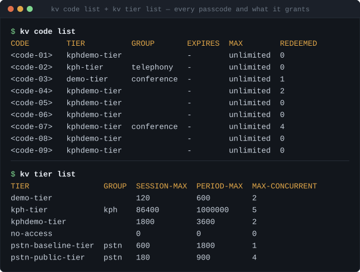

### `kv code list`

Lists every access code, via a query on the `accesscodes#` GSI1 partition — the
same access pattern the auth webapp uses, so what you see is what the login flow
sees.

| Flag | Default | Purpose |
|---|---|---|
| `--json` | `false` | emit the full records as JSON |

Columns: `CODE`, `TIER`, `GROUP`, `EXPIRES`, `MAX`, `REDEEMED`. `MAX` is the cap
on *unique-user* redemptions, `unlimited` when unset; `REDEEMED` counts unique
users who have redeemed it.

> **What this command does *not* show:** whether a code has a bypass `/join`
> link, and whether it has a caller-ID phone mapping. Neither attribute is on
> the record this command reads — not even with `--json`. For phone mappings use
> `kv telephony list`; for both at once use `kv studio`. This is the single most
> misleading thing about `kv code list`, and the reason the inventory runbook
> exists.

### `kv code create <code> --tier <tierId>`

Creates a code mapped to a tier.

| Flag | Default | Purpose |
|---|---|---|
| `--tier` | *(required)* | tier id this code grants |
| `--group` | *(none)* | free-text label, purely organisational |
| `--expires` | *(none)* | RFC3339 expiry, e.g. `2026-12-31T00:00:00Z` |
| `--max` | *(unlimited)* | max unique-user redemptions |

The code and tier id are normalised (and rejected outright if blank or
containing control characters, so malformed key material never reaches the
table). The tier is **not** validated to exist — creating a code against a
typo'd tier id succeeds here and fails at redemption time. Run `kv tier list`
first.

```bash
kv code create dc34floor --tier kphdemo-tier --group conference --max 200
```

### `kv code expire <code>`

Soft-expires a code by setting `expiresAt` to now. It does **not** delete the
row, so `redemptionCount` history survives. There is no un-expire; re-create the
code (or set a future `--expires`) to bring it back.

### `kv code bypass <code>`

Manages the per-code auto-login link — a URL you can hand out that logs someone
straight in with no email round trip.

| Flag | Default | Purpose |
|---|---|---|
| `--rotate` | `false` | mint a fresh token, invalidating the previous link |
| `--disable` | `false` | turn bypass off; the existing link starts 404ing |

`--rotate` and `--disable` are mutually exclusive. With neither flag, the command
enables bypass and prints the URL:

```
$ kv code bypass dc34floor
enabled bypass for code "dc34floor"
join URL: https://auth.klankermaker.ai/use1/join/<12-char-token>
```

The token is 12 characters of rejection-sampled base62 (~71 bits, no modulo
bias). Enabling twice **rotates** — calling `kv code bypass` on a code that
already has a link silently replaces it and breaks every copy of the old URL
already in the wild. Use `--rotate` when you mean that, so the intent is in your
shell history.

Origin and region are overridable via `KV_AUTH_ORIGIN` / `REGION_SHORT` for
non-production deployments.

### `kv code phone <code>`

Maps a caller's phone number to a code, so that person is auto-identified by
caller ID when they dial in — they land on that code's tier without entering
anything.

| Flag | Default | Purpose |
|---|---|---|
| `--add <e164>` | — | map this number (messy input is fine: `"+1 (416) 555-1234"`) |
| `--remove` | `false` | drop the mapping |

Mutually exclusive; one is required. The number is normalised to E.164 with the
*exact* algorithm the auth app uses — strip everything but digits and `+`, drop a
leading trunk zero run, prepend `1` to a bare 10-digit North-American number —
because a divergent normalisation silently breaks the `byPhone` index lookup and
the caller just... doesn't get recognised, with no error anywhere.

One number per code; re-running `--add` overwrites.

---

# `kv tier` — time budgets

A tier is the quota. Codes point at tiers; tiers set the numbers.

### `kv tier list`

| Flag | Default | Purpose |
|---|---|---|
| `--json` | `false` | emit as JSON |

Columns: `TIER`, `GROUP`, `SESSION-MAX` (seconds per single session),
`PERIOD-MAX` (seconds per rolling period), `MAX-CONCURRENT` (simultaneous
sessions).

The live tiers, and what each is for:

| Tier | Session | Period | Concurrent | Role |
|---|---|---|---|---|
| `pstn-public-tier` | 180s | 900s | 4 | **the public phone tier** — what an un-entitled caller gets on gate unlock |
| `pstn-baseline-tier` | 600s | 1800s | 1 | earlier, more generous PSTN tier |
| `demo-tier` | 120s | 600s | 2 | short conference demo |
| `kphdemo-tier` | 1800s | 3600s | 2 | the general-purpose demo tier most codes point at |
| `kph-tier` | 86400s | 1000000s | 5 | the operator's own tier — effectively unmetered |
| `no-access` | 0 | 0 | 0 | explicit deny |

`pstn-public-tier` is referenced by name from `configs/telephony.toml`'s
`unlock_tier_id`. **If that row is missing from the table, every public phone
call fails closed** — an absent tier is treated as no-access. Deleting it is a
site-wide phone outage with no error message anywhere except failed calls.

### `kv tier define <tierId>`

Creates *or replaces* a tier — it is a `PutItem`, not an update. Re-defining an
existing tier silently overwrites every field, including ones you did not pass
(they revert to the flag defaults).

| Flag | Default | Purpose |
|---|---|---|
| `--session-max` | *(required)* | max seconds per session |
| `--period-max` | *(required)* | max seconds per rolling period |
| `--max-concurrent` | `1` | max concurrent sessions |
| `--group` | *(none)* | label |

```bash
kv tier define pstn-public-tier --session-max 180 --period-max 900 \
  --max-concurrent 4 --group pstn
```

Changes take effect on the next session — there is no redeploy and no cache. A
tier change is the fastest lever you have during an event.

---

# `kv usage` — where the money went

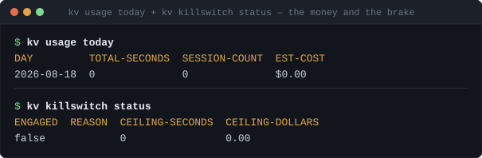

### `kv usage today`

Site-wide rollup for today, or one user's day with `--user-id`.

| Flag | Default | Purpose |
|---|---|---|
| `--user-id` | *(none)* | show this user's day instead of the site rollup |
| `--json` | `false` | emit as JSON |

The site rollup is a single `GetItem` against a pre-aggregated item — O(1), no
table scan, so it is safe to poll during an event. Columns: `DAY`,
`TOTAL-SECONDS`, `SESSION-COUNT`, `EST-COST`. A day with no traffic reads as
zeroes rather than erroring.

`EST-COST` is an *estimate* derived from `est_cost_per_second` in the pipeline
config (currently `0.005`), not a provider bill. Treat it as a tripwire, not
accounting.

### `kv usage history <user-id>`

One user's recent daily usage, most recent first.

| Flag | Default | Purpose |
|---|---|---|
| `--days` | `7` | how many most-recent days |
| `--json` | `false` | emit as JSON |

A single-partition query — also no scan.

---

# `kv killswitch` — the brake

One DynamoDB control item that the voice service's session-start gate reads on
**every** new session. Flipping it takes effect near-instantly with no restart
and no deploy. It is the most important command in this reference.

### `kv killswitch status`

| Flag | Default | Purpose |
|---|---|---|
| `--json` | `false` | emit as JSON |

Columns: `ENGAGED`, `REASON`, `CEILING-SECONDS`, `CEILING-DOLLARS`. A control
item that has never been written reads as disengaged — that is the correct
default, not a missing-data error.

### `kv killswitch on`

Engages the switch: **every new voice session, browser and phone alike, is
refused site-wide.** Sessions already in progress are not killed.

| Flag | Default | Purpose |
|---|---|---|
| `--reason` | `operator` | recorded on the control item |

Idempotent by conditional write — engaging an already-engaged switch prints
`killswitch already engaged (no-op)` and is not an error. Set a real `--reason`;
it is what tells you later whether a human or the automatic cost-ceiling trip
pulled the brake.

### `kv killswitch off`

Disengages and **clears the reason**, which is the explicit operator reset for an
automatic trip. Also idempotent.

> If the switch auto-tripped on a cost ceiling, turning it off without changing
> anything else means it will trip again. Read
> [the incident runbook](incident-runbook.md) first.

---

# `kv telephony` — the inbound phone surface

Three subcommands answering three different questions: *what is configured*,
*how are callers doing in aggregate*, and *who specifically called*.

### `kv telephony list`

**This is the answer to "what phone numbers do I own".** It is the only command
that assembles all four sources of telephony truth into one report.

| Flag | Default | Purpose |
|---|---|---|
| `--show-secrets` | `false` | decrypt and print the gate secrets from SSM |
| `--config` | `apps/voice/configs/telephony.toml` | telephony TOML to read |
| `--json` | `false` | emit as JSON |

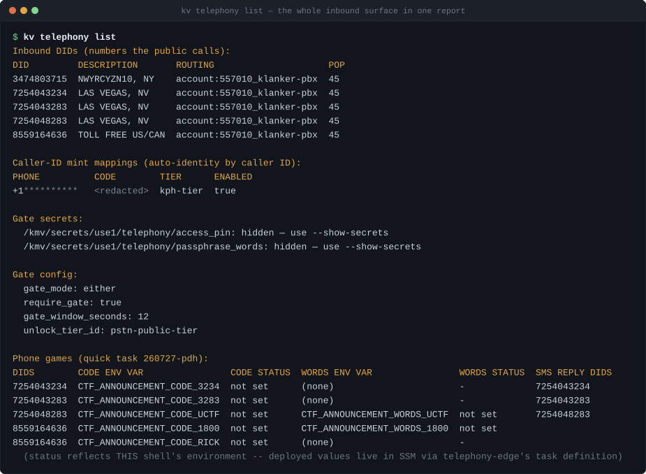

Five sections, from five different places:

1. **Inbound DIDs** — live from the VoIP.ms API (`getDIDsInfo`). The numbers the
   public dials. This is the authoritative list.
2. **Caller-ID mint mappings** — from DynamoDB. Keyed by the *caller's* number,
   not the dialled one: people who get auto-identified when they call in.
3. **Gate secrets** — from SSM. Status only by default; `--show-secrets` prints
   the values, which is why it is opt-in.
4. **Gate config** — a deliberately minimal scan of the `[telephony]` block for
   four keys. Not a full TOML parse; `kv` carries no TOML dependency.
5. **Phone games** — every `[[telephony.announcement]]` block, with env status.

Every section degrades independently: no VoIP.ms credentials, no SSM permission,
or a missing TOML each collapse that one section to a status line and leave the
rest intact.

> **`CODE STATUS: not set` is normal and does not mean broken.** That column
> reflects *your shell's* environment, and the game codes only ever live in the
> deployed task's environment via SSM. `not set` locally is expected. The
> command says so in its own footer.

With `--show-secrets`, an SSM permission failure is reported per-secret as
`error — AccessDenied` rather than failing the command.

### `kv telephony stats`

Per-DID call analytics from the `game_call_event` telemetry the telephony edge
emits at call teardown, via a CloudWatch Logs Insights query.

| Flag | Default | Purpose |
|---|---|---|
| `--since` | `24h` | how far back (e.g. `90m`, `720h`) |
| `--did` | *(all)* | filter to one dialled DID |
| `--log-group` | `/ecs/telephony-edge-telephony-edge-use1-kmv` | log group |
| `--json` | `false` | emit as JSON |

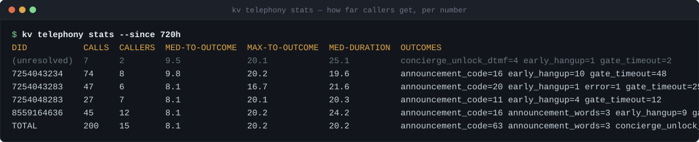

This is the **caller-anonymous** view: it reports a distinct-caller *count* and
never a raw number. Columns: calls, distinct callers, median and max
seconds-to-outcome, median duration, and an outcome breakdown, plus a `TOTAL`
row.

The outcome vocabulary is the thing to learn:

| Outcome | Means |
|---|---|
| `announcement_code` | caller entered a game's DTMF code and heard its script |
| `announcement_words` | caller *said* a game's spoken trigger instead |
| `concierge_unlock_dtmf` | caller passed the gate PIN and reached the actual agent |
| `gate_timeout` | the gate window expired with no valid factor — the fail-closed path |
| `early_hangup` | caller hung up before any outcome |
| `error` | pipeline error; the call was torn down |

`(unresolved)` in the DID column means the dialled number could not be recovered
for those calls — see the two-bucket explanation under `calls` below.

Insights queries are billed by bytes scanned. `--since 720h` over this log group
is cheap at current volumes, but it is not free; prefer the narrowest window
that answers your question.

### `kv telephony calls`

The identity-bearing sibling of `stats`: **who** called **which number**, and
**when**. Raw caller numbers are always shown — there is no flag to hide them.

| Flag | Default | Purpose |
|---|---|---|
| `--view` | `callers` | `callers`, `calls`, `numbers`, `new`, or `all` |
| `--since` | `24h` | how far back |
| `--new-within` | `1h` | first-seen recency that counts as "new" (`--view new`) |
| `--did` | *(all)* | filter to one dialled DID |
| `--caller` | *(all)* | filter to one raw caller number |
| `--log-group` | `/ecs/telephony-edge-telephony-edge-use1-kmv` | log group |
| `--config` | `apps/voice/configs/telephony.toml` | source of the DID labels |
| `--json` | `false` | emit **every** view's data regardless of `--view` |

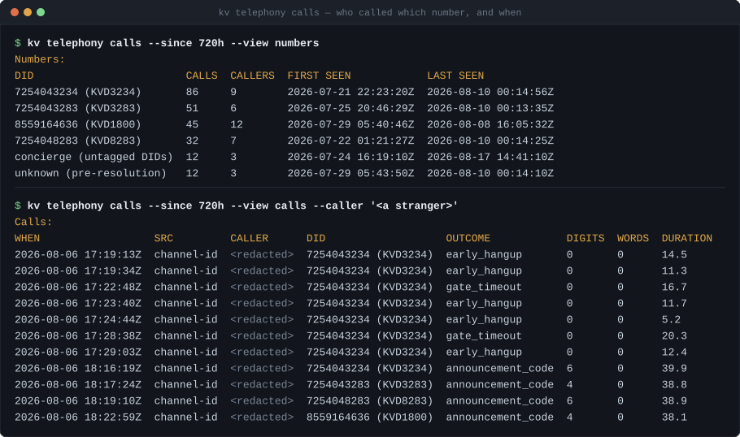

It joins two log sources by ARI channel id: `on_stasis_start` lines (present for
every call, back to first deploy) and `game_call_event` teardown lines (only
since ~2026-07-28, and not on every call). So history reaches further back than
teardown telemetry alone would allow, and a call that never reached teardown
still appears — with `(no teardown event)` as its outcome rather than being
dropped.

Two facts worth internalising:

- **Call time never comes from CloudWatch's `@timestamp`.** That is *ingestion*
  time, and the edge batches, so three genuinely distinct calls can share one.
  Time is derived from the epoch prefix in the ARI channel id, falling back to
  the log line's own timestamp.
- **There are two different "unknown DID" buckets and they are not the same
  thing.** `unknown (pre-resolution)` is a call from before per-DID resolution
  existed — the dialled number is genuinely unrecoverable. `concierge (untagged
  DIDs)` is a modern call on a DID with no caller-ID prefix tag, i.e. a plain
  concierge line rather than a game line. Merging them would invent a number
  that was never dialled.

---

# `kv voipms` — the carrier side

Wraps the API-drivable parts of VoIP.ms provisioning. The portal-only security
steps (2FA, international lock, balance alerts, the API IP allow-list) are
deliberately *not* automated — see the
[VoIP.ms provisioning runbook](voipms-provisioning-runbook.md).

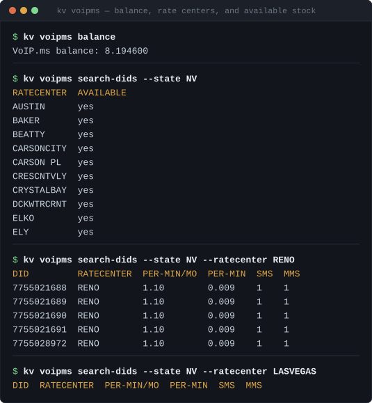

## Read-only

### `kv voipms balance`

Prints the account balance. No flags. **Check this before an event**: with
auto-recharge deliberately off, a drained balance stops inbound calls routing —
which fails closed, quietly, as "the phone number doesn't work".

### `kv voipms search-dids --state <ST>`

| Flag | Default | Purpose |
|---|---|---|
| `--state` | *(required)* | US state abbreviation |
| `--ratecenter` | *(none)* | omit to list the state's rate centers; supply to list available numbers |

Two modes in one command. Without `--ratecenter` you get the rate centers so you
can pick one; with it you get numbers and pricing. An empty table means that
rate center has no stock right now — Las Vegas is frequently empty, which is why
the Vegas numbers were bought when they were.

### `kv voipms search-tollfree`

| Flag | Default | Purpose |
|---|---|---|
| `--query` | *(none)* | digit pattern; omit to list the general stock |
| `--type` | `contains` | `starts`, `contains`, or `ends` — only used with `--query` |
| `--usa-only` | `false` | search the US-only-reach pool |

Defaults to numbers reachable from **both** Canada and the US. A US-only
toll-free number rejects Canadian callers outright, so `--usa-only` is an
explicit opt-in rather than a default.

Toll-free rows come back with blank pricing columns — that is VoIP.ms's
response, not a `kv` bug. A pattern with no matches returns
`status "unavailable_info"`, which reads like an error but simply means "nothing
matched".

### `kv voipms set-caps`

**Always fails, on purpose.** The VoIP.ms API has no per-call max-duration
method (verified against the live method registry). Rather than silently
pretend, this command errors and tells you where the cap actually lives: the
Asterisk/controller call timer bounds a single call, and the portal-only balance
protections bound total spend.

## Writes

### `kv voipms order-did <did>`

Orders a number. **This spends money** — a monthly fee plus per-minute charges.

| Flag | Default | Purpose |
|---|---|---|
| `--routing` | `account:557010_klanker-pbx` | routing target |
| `--pop` | `45` | VoIP.ms POP id (45 = `toronto1.voip.ms`) |
| `--dialtime` | `60` | seconds before failover |
| `--cnam` | `0` | CNAM lookup (keep off — it costs per call *and* breaks caller-ID prefix tagging) |
| `--billing-type` | `1` | 1 = per-minute |

The defaults are exactly what was used to order the live Vegas numbers, so in
practice `kv voipms order-did 7255551234` is the whole command.

> **The POP must match.** The DID's POP has to be the same POP Asterisk
> registers to. VoIP.ms delivers inbound calls over the *registered* leg; a
> mismatch means the number rings nowhere, with no error at order time.

### `kv voipms order-tollfree <did>`

Same flags, same defaults, different API method — the geographic `orderDID` does
not cover toll-free stock. Note `--billing-type 1` is the only option; toll-free
has no flat-rate plan.

### `kv voipms route-did <did>`

| Flag | Default | Purpose |
|---|---|---|
| `--subaccount` | `klanker-pbx` | subaccount username to route to |

Points an already-owned number at the PBX subaccount. This is the "adopt an
existing number" path — it never purchases anything.

### `kv voipms set-cid-prefix <did> <tag>`

Sets the caller-ID name prefix on a DID. This is how the telephony edge knows
*which number was dialled*, since VoIP.ms routes every DID to one shared
subaccount and the dialled number is otherwise invisible at the edge. The tag
must match a key in `[telephony.cid_prefix_dids]`.

Three hard-won behaviours are baked in, and they are the reason to use this
rather than the portal:

1. **Full-snapshot preserve.** VoIP.ms's `setDIDInfo` is full-*replace*: any
   field you omit is reset to its default. The command snapshots the DID first
   and re-sends routing, POP, dial time, billing type, description, note, all
   three failover targets, voicemail and Canada routing.
2. **`cnam` is forced to `0`.** With CNAM lookup on, VoIP.ms overwrites the
   caller-ID name — so the prefix never arrives and per-DID resolution silently
   stops working. This was a real, live silent failure on one of the Vegas
   numbers.
3. **Readback verification.** After writing, it re-reads the DID and refuses to
   report success unless routing survived *and* the prefix actually landed.

Transport failures retry up to three times with backoff (the VoIP.ms Cloudflare
front intermittently 522s); genuine API rejections are never retried.

### `kv voipms clear-cid-prefix <did>`

Same machinery, empty prefix. The DID stops resolving to a specific game and
falls back to the untagged concierge path.

### `kv voipms create-subaccount`

| Flag | Default | Purpose |
|---|---|---|
| `--username` | `klanker-pbx` | subaccount to create |
| `--password` | *(required)* | SIP password — generate a strong unique value |
| `--allowed-ip` | *(none)* | restrict the subaccount to this IP |

Creates the PBX subaccount **outbound-locked** (`lock_international=1`) and, with
`--allowed-ip`, IP-restricted. Codecs are ulaw-only, device type Asterisk/IP-PBX.
Outbound calling is never enabled by this command or any other.

Confirm the result in the portal afterwards. The parameter *names* are verified,
but only the portal shows you that a parameter *value* did what you meant.

### `kv voipms cancel-did <did> --yes`

**Irreversible.** Releases the number back to the VoIP.ms pool; you cannot
reclaim it, and someone else can take it. Refuses to run without `--yes`.

Cancelling is also the only way to free an account DID slot — which is exactly
why the old 613 number is gone.

---

# `kv knowledge`

### `kv knowledge refresh`

Regenerates the concierge's per-topic knowledge packs and its local BM25/FTS5
retrieval index from the checked-in manifest. A thin dispatcher: it locates
`apps/voice/scripts/refresh_knowledge.py` and runs it under `uv`.

| Flag | Default | Purpose |
|---|---|---|
| `--dry-run` | `false` | write to a temp dir, skip the LLM distillation pass |
| `--skip-distill` | `false` | chunk/index build and lint only, no LLM pass |
| `--force` | `false` | overwrite a topic even if the new corpus has *fewer* chunks than what is committed |

Requires `uv` and the repo. Offline and deliberate only — never run it during a
live session. Output lands in the tracked `knowledge/` tree for human review
before commit; that git diff *is* the safety gate, so read it.

`--force` exists because a shrinking chunk count usually means a source went
missing or a fetch failed, not that the corpus genuinely got smaller. The guard
fires far more often on a bug than on an intent.

`make -C apps/voice knowledge` runs the same thing.

---

# `kv smoke`

Proves the deployed pipeline actually carries audio: it sends a real WebRTC
offer to `/api/offer`, negotiates ICE to connected, and counts inbound RTP
packets before tearing down.

| Flag | Default | Purpose |
|---|---|---|
| `--endpoint` | `https://voice.klankermaker.ai` | service base URL |
| `--json` | `false` | emit as JSON |

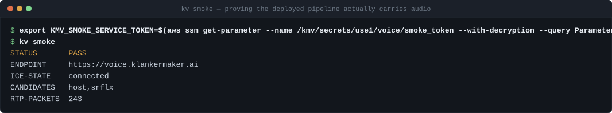

Requires `KMV_SMOKE_SERVICE_TOKEN` in the environment — the dedicated service
credential the voice service recognises ahead of JWKS validation, marking the
session as bypassing accounting. Pull it from SSM at
`/kmv/secrets/use1/voice/smoke_token`.

Bounded so a stuck run can never hold a slot: 15s for the offer, 15s for ICE, a
5s RTP observation window.

**`RTP-PACKETS` is the assertion that matters.** ICE reaching `connected` only
proves a path was negotiated; a non-zero packet count proves the pipeline is
actually speaking. A run that connects with zero RTP is a `FAIL`, and `kv` exits
non-zero on `FAIL` so it works in a deploy gate.

---

# `kv studio`

A local, loopback-only web console over everything above.

| Flag | Default | Purpose |
|---|---|---|
| `--port` | `7420` | TCP port on `127.0.0.1` |
| `--no-open` | `false` | don't open a browser |

It binds `127.0.0.1` only. **There is no `--host` flag** and that is a design
decision, not an omission. Ctrl-C stops it.

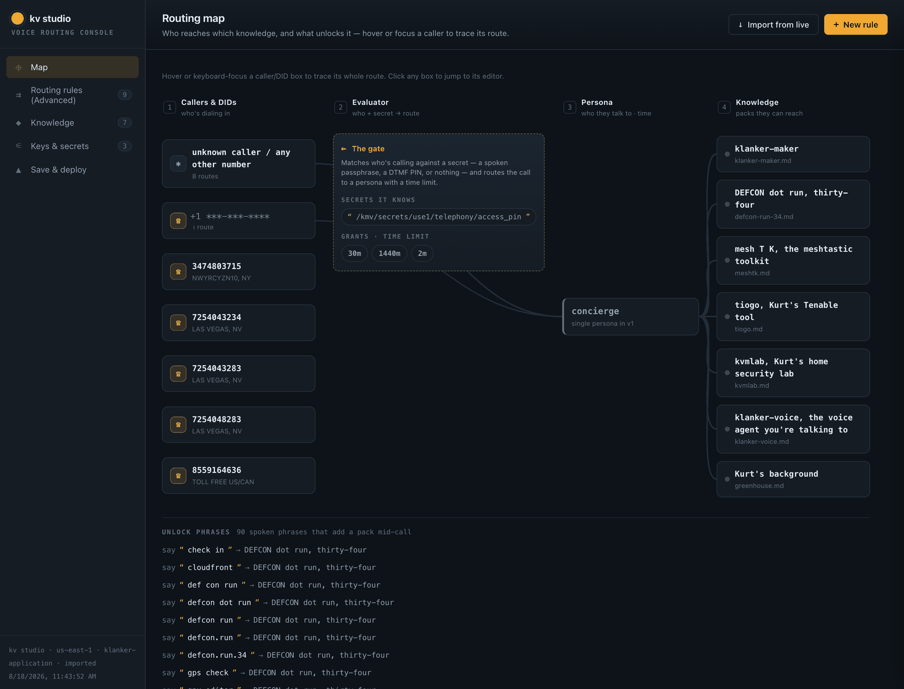

Studio is a GUI over the CLI's existing authority — same DynamoDB table, same
repo files, same SSM parameters, same `--profile`/`--region`. It is not a second
source of truth and there is no separate service to deploy.

Five tabs:

| Tab | Shows |
|---|---|
| **Map** | the whole routing graph — callers/DIDs → the gate → persona → knowledge packs |
| **Routing rules** | first-match-wins rules: caller + secret → time budget, knowledge, persona |
| **Knowledge** | the per-topic packs and their unlock phrases |
| **Keys & secrets** | the gate secrets, with on-demand reveal and rotate |
| **Save & deploy** | capture the configuration as a git-committed SOP snapshot |

The DID manager lives in a modal off the rules tab (or jump straight to it with
`http://127.0.0.1:7420/#dids`), and is the friendliest view of the number
inventory:

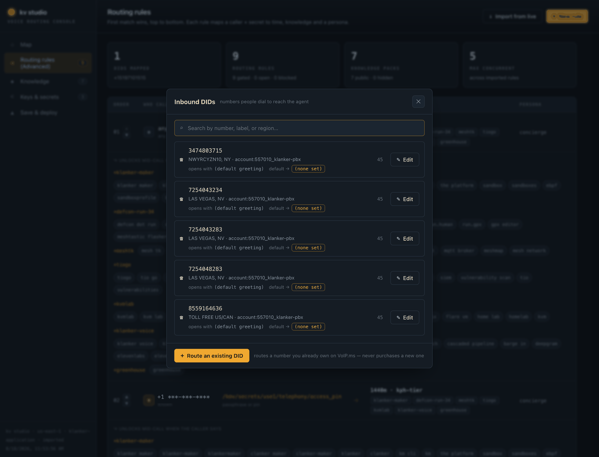

Secrets are never written to browser storage — a reveal is fetched on demand and
cleared when you hide it or navigate away:

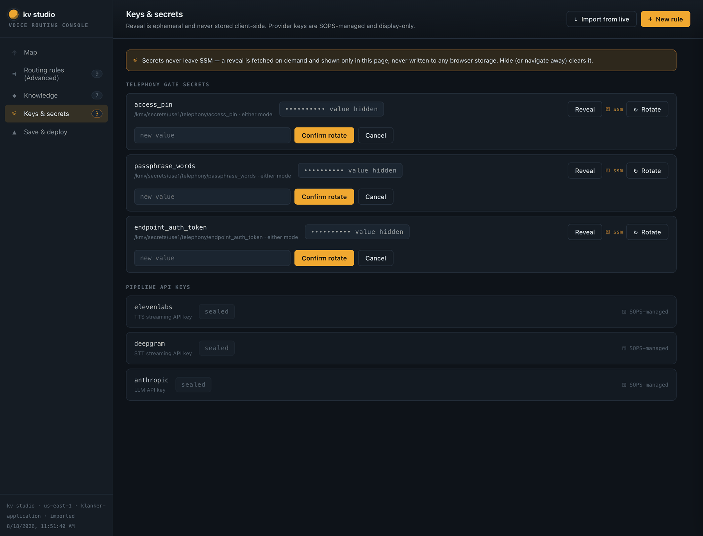

If VoIP.ms credentials can't be resolved, studio still starts and every other
tab works; only the live DID list and the routing action degrade. See the
[kv studio operator guide](kv-studio-operator-guide.md) for the SOP/deploy flow.

---

## Exit behaviour

Every command exits `0` on success and `1` on error, printing `error: <message>`
to stderr. Three cases are deliberately **not** errors:

- `killswitch on`/`off` when already in that state — reported as `(no-op)`.
- A degraded section in `telephony list` — reported inline, command still exits 0.
- `usage`/`killswitch` reads with no data yet — reported as zeroes/disengaged.

And one case is deliberately an error even though nothing went wrong:
`voipms set-caps`, which fails to tell you the capability does not exist.

## Shell completion

```bash
kv completion zsh > "${fpath[1]}/_kv"     # zsh
kv completion bash > /etc/bash_completion.d/kv
```

---

## Known gaps

Honest notes on where the tooling does not yet match the questions operators ask
of it:

- **No `kv voipms list-dids`.** The account's DIDs are listed only as a section
  of `kv telephony list` (and in studio). The underlying lister exists in the
  code; it has no command of its own.
- **`kv code list` hides bypass and phone state.** As above — you need two more
  commands, or studio, to see a code's full configuration.
- **No `kv tier delete` and no `kv code delete`.** Expiry is the only removal
  path for codes; tiers can only be overwritten.
- **Game codes are not readable through `kv`.** `kv telephony list` shows which
  env var each game uses and whether *your shell* has it — never the deployed
  value. Read those from SSM directly.
