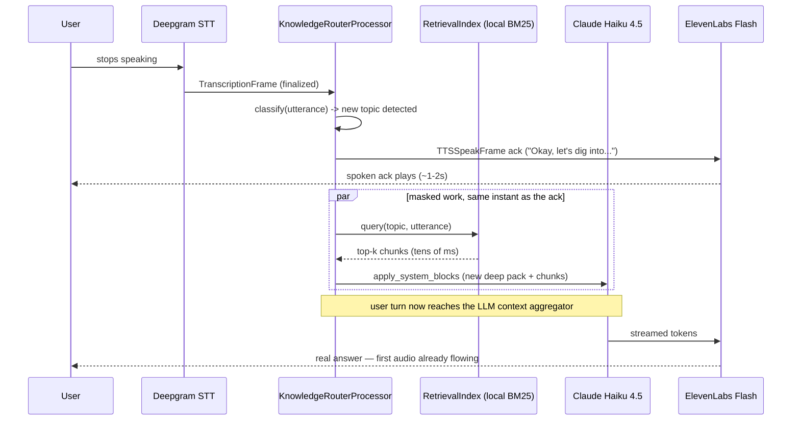

<!-- generated-by: gsd-doc-writer -->
# Techniques: How klanker-voice Feels Fast and Human

klanker-voice's core value is that a conversation feels *slick* — the design
target is 1.2 seconds voice-to-voice with natural barge-in. No single trick
gets there. Instead the codebase leans on a handful of deliberate,
narrow-purpose techniques that each hide, pace, or soften one specific piece
of latency or robotic behavior. This page collects them in one place, each
with the problem it solves, how it's implemented (with file references you
can go read), and why it works perceptually.

For the surrounding system context see `docs/architecture/overview.md`; for
the turn-by-turn cascade these techniques sit inside, see
`docs/dataflows/conversation-loop.md`; for the PSTN-specific path the RTP
pacing technique protects, see `docs/dataflows/telephony-voipms.md`.

## 1. Ack masking — hiding retrieval + LLM latency behind a spoken beat

**Problem.** When a visitor switches topics mid-conversation, the pipeline
needs to do real work before the LLM can answer well: reclassify the
utterance, swap in a new "deep pack" of topic knowledge, and (Phase 7) run a
local BM25 retrieval query for extra grounding chunks. Doing all of that
silently after the visitor stops talking would produce a dead gap before the
concierge speaks — the single most damaging thing to a "slick" feel.

**Mechanism.** `KnowledgeRouterProcessor` sits between the STT service and
the LLM context aggregator (`apps/voice/src/klanker_voice/pipeline.py:144-176`,
inserted at the exact point documented in the `build_pipeline` docstring at
`pipeline.py:103-114`). On a finalized `TranscriptionFrame`
(`apps/voice/src/klanker_voice/knowledge/router.py:290-291`), it classifies
the utterance against a weighted keyword map, falling back to a same-vendor
Haiku classification call only below a confidence floor
(`router.py:83-167`). The moment it detects a genuine topic switch, it fires
a deterministic spoken acknowledgment via `TTSSpeakFrame` — round-robining
through `DEFAULT_ACK_TEMPLATES` (`router.py:69-74`) — and, in the same
`_commit_switch` call, swaps the LLM's cached system block and queries the
local retrieval index (`router.py:335-386`, ack fired at `router.py:378-386`,
retrieval query at `router.py:345-359`). Because the ack's audio takes a
couple of seconds to play, the pack swap and the "local (tens of ms) BM25
query" finish well within that window — the router module docstring calls
this out explicitly as intentional: "the local BM25 query's cost is
ack-masked" (`router.py:17-26`).

The ack line itself can be overridden per topic (`_topic_ack_templates`,
`router.py:207-220`) — the hidden `greenhouse` recruiting easter egg uses its
own playful opener — or suppressed entirely with an explicit empty
`ack: ""` in the topic map, which the router treats as "the LLM's own
opener is the sole output" (`router.py:326-332`).

**Why it works.** Perceptually, a filled pause reads as "thinking," while a
silent pause reads as "broken" or "did it hear me?" A short, varied verbal
beat gives the visitor's brain something to track while the expensive work
happens off-screen, and because the templates rotate and some topics get
custom lines, it doesn't feel like a canned loading spinner.

**Where to look.** `apps/voice/src/klanker_voice/knowledge/router.py`
(`DEFAULT_ACK_TEMPLATES`, `KnowledgeRouterProcessor._commit_switch`,
`_topic_ack_templates`), `apps/voice/src/klanker_voice/pipeline.py:103-114`
(insertion-point rationale), `apps/voice/tests/test_knowledge_router.py`.

## 2. Instant pre-rendered greeting — first audio before the connection even lands

**Problem.** WebRTC connect + the first LLM turn both take real time. If the
concierge's first words wait for either, the visitor stares at a silent
screen for the most latency-sensitive moment of the whole session: the very
first impression.

**Mechanism.** The browser client plays a locally cached MP3 the instant the
visitor taps the mic — before the WebRTC offer/answer has even completed.
`primeGreeting()` (`apps/voice/client/src/greeting/greetingPlayer.ts:102-131`)
must be called synchronously inside the tap gesture: it arms a real
`Audio` element at volume 0 so Safari/WebKit "blesses" it for a later,
out-of-gesture `.play()` call — the classic iOS autoplay-unlock trick, layered
under a silent no-op `unlockAudioPlayback()` (`greetingPlayer.ts:71-86`) that
exists purely to satisfy the gesture requirement even if priming itself
hasn't finished loading the manifest yet. Once the session's Live screen
mounts, `playRandomGreeting()` resumes that armed element at full volume
(`greetingPlayer.ts:133-160`) rather than constructing a new one — the resume
is what WebKit's autoplay policy actually permits.

The clip itself is not generated fresh per session and is not TTS running
live — it's a pre-rendered file served from
`apps/voice/client/public/greetings/`, listed in
`greetings.manifest.json` alongside the voice ID and model used to render
it. `scripts/render_greetings.py` builds that manifest from
`greetings.source.json` by calling the ElevenLabs API once, offline, reusing
the exact same `[tts]` voice settings (`stability`/`similarity_boost`/`style`)
the live service uses (`render_greetings.py:33-42`) so the pre-rendered clip
and the live voice sound like one character. As of this writing, the shipped
clip (`greeting-1.mp3`) is not the script's raw output — it's a
hand-picked, ffmpeg-spliced take, and the manifest itself carries a warning
against re-running the render casually:

> "greeting-1.mp3 is a HAND-PICKED SPLICED take (2026-07-12, Kurt-approved
> delivery). Do NOT re-run `make greetings` casually — a fresh render of the
> same text will replace this exact delivery with a random new one."
> — `apps/voice/client/public/greetings/greetings.manifest.json:4`

`tests/test_greeting_voice_drift.py` is the CI guard that catches a
`voice_id`/settings change in `pipeline.toml` that would silently orphan the
clip from the live voice.

Because the greeting is pre-played client-side, the server must never greet
again on top of it. `pipeline.toml` sets `persona.greet_first = false`
specifically for this reason (`apps/voice/pipeline.toml:39-41`), which
suppresses `register_greet_first`'s server-side greet kick
(`apps/voice/src/klanker_voice/pipeline.py:249-279`,
wired conditionally at `apps/voice/src/klanker_voice/call_runtime.py:205-206`).
The harder problem — the concierge re-greeting or re-listing the menu on its
*first spoken turn* even though it never actually said the greeting out loud
itself — was fixed by removing a leaky context-seeded instruction and moving
the "don't re-greet" logic entirely into the persona's own system prompt, so
it never appears as a context turn the model can read aloud:

> "A short spoken greeting has ALREADY been played to the user the instant
> they connected... It is not something you say, it already happened. So
> NEVER open a turn with a greeting or a self-introduction."
> — `apps/voice/prompts/concierge.md:8-20` ("Opening move" section)

`apps/voice/tests/test_regreet_suppression.py` documents the original bug
(pipecat's Anthropic adapter converts `developer`-role context messages to
user-role turns, so the old suppression instruction got read aloud on a
content-free first turn like "alright") and asserts the negative: no such
developer message is ever seeded into the context, for `greet_first` true or
false. `apps/voice/tests/test_greet_first_config.py` covers the config
parsing for the `greet_first` flag itself.

**Why it works.** The visitor hears a voice within a few hundred milliseconds
of tapping, well before any network round trip could possibly deliver one —
that's the "whoa" moment the project's design brief calls for. Splicing a
hand-picked take rather than trusting whatever ElevenLabs generates on a
given render also avoids the TTS lottery landing on an awkward first
impression for the one clip every visitor hears.

**Where to look.** `apps/voice/client/src/greeting/greetingPlayer.ts`,
`apps/voice/client/public/greetings/greetings.manifest.json` +
`greetings.source.json`, `apps/voice/scripts/render_greetings.py`,
`apps/voice/prompts/concierge.md`, `apps/voice/src/klanker_voice/pipeline.py`
(`GREET_KICK_MESSAGE`, `register_greet_first`, `greet_now`),
`apps/voice/tests/test_regreet_suppression.py`,
`apps/voice/tests/test_greet_first_config.py`,
`apps/voice/tests/test_greeting_voice_drift.py`.

## 3. RTP pacing clock — sending PSTN audio on a real-time cadence

**Problem.** Text-to-speech audio doesn't arrive from ElevenLabs in a smooth
20ms-at-a-time stream — it arrives in bursts. For the browser WebRTC path
that's fine, because the WebRTC media stack itself paces the outgoing track.
But the PSTN telephony leg talks raw RTP over a plain UDP socket to
Asterisk's `externalMedia` channel, and `sendto()` returns instantly with no
back-pressure at all. Without pacing, a whole TTS utterance's worth of RTP
packets gets blasted at Asterisk in a burst; Asterisk has no read-side
jitter buffer on that leg, so it forwards the burst straight through to
VoIP.ms/PSTN and callers heard constant garble on every utterance — this was
a real, live-verified production bug (see
`.planning/debug/resolved/telephony-outbound-garble.md`, referenced directly
in the fix).

**Mechanism.** `TelephonyOutputTransport.write_audio_frame`
(`apps/voice/src/klanker_voice/telephony/transport.py:273-290`) resamples
each outgoing pipeline audio frame down to 8kHz, mu-law encodes it in
160-sample (20ms) chunks via `PcmFramer`, RTP-packetizes each chunk, and —
critically — calls `await self._pace()` before every single
`write_packet()`. `_pace()` (`transport.py:292-306`) maintains a monotonic
`_next_send_time` schedule, advancing it by exactly one `packet_interval`
(`packet_time_ms / 1000.0`, from `TelephonyTransportParams`) per packet, and
sleeps until that instant arrives — so exactly one 20ms packet leaves the
socket per 20ms of wall-clock time, matching the RTP timestamp cadence the
receiver expects. The schedule resyncs to "now" whenever it's fallen more
than one interval behind (`transport.py:301`), so a natural pause between
utterances — or a post-barge-in flush — restarts the cadence cleanly instead
of producing a catch-up burst. `flush()` (`transport.py:308-317`) drops any
buffered-but-incomplete PCM tail on interruption and resets `_next_send_time`
to `None` so the next utterance's pacing starts fresh from its own first
packet.

The pacing lives in `transport.py`, not in the codec module: `media.py`
supplies the pure, stateless building blocks it paces —
`PcmFramer`/`RtpPacketizer`/`ulaw_encode`
(`apps/voice/src/klanker_voice/telephony/media.py`) — and `rtp_socket.py`
supplies the live UDP socket the already-paced packets are written to, with
symmetric-RTP peer-address learning so replies go back to whichever
`(ip, port)` Asterisk's most recent inbound datagram came from
(`apps/voice/src/klanker_voice/telephony/rtp_socket.py:37-73`,
`SocketRtpMediaSession.write_packet` at `rtp_socket.py:121-129`).

**Why it works.** PSTN/RTP playback quality depends entirely on packets
arriving at a steady, predictable cadence — the receiving end has no
buffering to smooth over an uneven feed the way a modern streaming media
player does. Reinstating the wall-clock cadence that the upstream TTS
service doesn't naturally provide is what makes phone-call audio sound like
a phone call instead of a stutter.

**Where to look.**
`apps/voice/src/klanker_voice/telephony/transport.py`
(`TelephonyOutputTransport._pace`, `write_audio_frame`, `flush`),
`apps/voice/src/klanker_voice/telephony/media.py` (codec + framing
primitives), `apps/voice/src/klanker_voice/telephony/rtp_socket.py`
(the live socket + peer learning), `docs/dataflows/telephony-voipms.md`.

## 4. Backchannel vs. interruption — not every sound is a barge-in

**Problem.** The shipped cascade is half-duplex-with-barge-in: the instant
the visitor makes any sound while the concierge is talking, the pipeline
fires an interruption and yields the floor. That's the right behavior for a
real interruption, but it's wrong for the natural "mm-hm", "yeah", "right" a
listener drops in to mean *keep going* — those would otherwise cut the
concierge off mid-word on every single listening cue.

**Mechanism.** `DuplexController`
(`apps/voice/src/klanker_voice/duplex.py:88-259`) is an opt-in processor
(the `voice2` full-duplex variant, `apps/voice/configs/voice2.toml:64-75`)
sitting in the same pipeline slot as the knowledge router. Pipecat's worker
queues an `InterruptionFrame` downstream the moment the visitor starts
speaking over the bot; because that frame reaches `DuplexController` before
it reaches the aggregator/LLM/TTS, the controller can withhold it. It HOLDS
the frame, waits up to `interruption_hold_ms` for the first transcript
(`_hold_interruption`, `duplex.py:179-197`), then classifies the utterance
with `classify_user_speech` (`duplex.py:69-85`): non-empty, at most
`max_backchannel_words` words, and every word drawn from a curated
backchannel lexicon → **backchannel**, drop the held interruption and
swallow the eventual finalized transcript so it never becomes a user turn
(`_maybe_decide`, `duplex.py:199-210`). Anything else — including an empty
transcript or a timeout with no transcript at all — releases the
interruption as a genuine barge-in (`_release_held`, `duplex.py:212-217`;
fail-safe timeout at `_hold_timeout`, `duplex.py:187-197`): a real
interruption must never be silently swallowed.

The controller can also optionally have the concierge emit its own short
"mm-hm" while the visitor is mid-turn (`backchannel_emitter`,
`_maybe_emit`, `duplex.py:231-258`) — rate-limited and only after a long
continuous stretch of talking, sent straight to TTS via `TTSSpeakFrame`
with `append_to_context=False` so it never pollutes the LLM's context,
mirroring the same pattern `pipeline.speak_goodbye` uses for the
deterministic goodbye line.

**Why it works.** Withholding the barge-in trades a small amount of latency
on genuine interruptions (bounded by `interruption_hold_ms`, 250ms in
`voice2.toml`, or first-partial time, whichever is shorter) for not
constantly cutting the concierge off on ordinary listening noises — the kind
of trade a human conversational partner makes instinctively and a naive
VAD-triggered barge-in can't.

**Where to look.** `apps/voice/src/klanker_voice/duplex.py`,
`apps/voice/configs/voice2.toml` (`[duplex]` table),
`apps/voice/src/klanker_voice/config.py` (`DuplexConfig`).

## 5. Pronunciation normalization — making TTS say klanker jargon correctly

**Problem.** ElevenLabs mispronounces several of the project's own proper
nouns and acronyms — `defcon.run.34`, `meshtk`, `kvmlab`, `km`, `CISSP`, and
more read wrong or robotically if spoken as literal text.

**Mechanism.** `PronunciationTextFilter`
(`apps/voice/src/klanker_voice/pronunciation.py:71-85`) is a pipecat
`BaseTextFilter` wired into the ElevenLabs service via `text_filters=[...]`
(`apps/voice/src/klanker_voice/factories.py:118-121`), which pipecat applies
after text aggregation but before synthesis — so it rewrites only what gets
spoken, never what appears in captions (those are built from the upstream
`LLMTextFrame`, before this filter runs). `_RULES`
(`pronunciation.py:30-61`) is an ordered list of word-boundary-anchored
regex substitutions, longest/most-specific first so e.g. `defcon.run.34` is
normalized before the bare `defcon` rule fires on a substring of it. A few
real mappings from the table:

| Written | Spoken |
|---|---|
| `defcon.run.34` | "deaf con run thirty four" |
| `meshtk` | "Mesh Tee Kay" |
| `tiogo` | "tee oh go" |
| `kvmlab` | "kay vee em lab" |
| `km CLI` | "klanker maker tool" |
| `kv` | "klanker voice" |
| `OWASP` | "Oh wasp" |
| `CISSP` | "sissp" |
| `MiTM` | "man in the middle" |

**Why it works.** A mispronounced acronym or project name is one of the
fastest ways to break the illusion that a natural conversational partner is
speaking — it reads as "robot voice" even when everything else about the
delivery is smooth. Fixing it once, in one filter, keeps every downstream
consumer (persona prompt, knowledge packs, greetings) free to use the
correctly-spelled, correctly-capitalized form.

**Where to look.** `apps/voice/src/klanker_voice/pronunciation.py`,
`apps/voice/src/klanker_voice/factories.py:102-122`
(`_build_tts_elevenlabs`).

## 6. Per-topic ambience beds — a soundscape that matches the conversation

**Problem.** A voice with nothing behind it can feel sterile, especially for
a project that's meant to evoke "you're standing at a conference booth" or
"you're chatting over coffee." A static background bed everywhere is
better than silence but doesn't track what's actually being discussed.

**Mechanism.** `build_ambience_mixer`
(`apps/voice/src/klanker_voice/pipeline.py:195-228`) builds one
`SoundfileMixer` per session, mixing OFF by default, registering every WAV
under `apps/voice/assets/ambience/` (currently `conference.wav` and
`coffee-shop.wav`) keyed by filename stem so a topic map entry can reference
either by name with no code change. `KnowledgeRouterProcessor._toggle_ambience`
(`apps/voice/src/klanker_voice/knowledge/router.py:252-285`) drives the
mixer on every committed topic switch: it's **reconciling, not
differential** — on each switch it sets the mixer to exactly the new
topic's `ambience:` bed (with an optional per-topic volume override) and
enables it, or disables mixing outright when the new topic declares no bed.
Because the decision depends only on the new topic (never on what was
playing before), a missed transition self-heals on the very next switch and
a stale bed can never be left layered under a new scene.

**Why it works.** Ambient sound is a cheap, low-risk way to add situational
texture — a conference hall bed under DEF CON/`defcon.run` talk, a
coffee-shop bed under the recruiting/`greenhouse` easter egg — without
touching the voice pipeline's latency path at all (it's mixed client-side
into the output audio, independent of the STT/LLM/TTS cascade). The
reconciling design specifically avoids a subtle class of bug where a bed
from two topics ago keeps playing under the current one.

**Where to look.** `apps/voice/src/klanker_voice/pipeline.py`
(`build_ambience_mixer`), `apps/voice/src/klanker_voice/knowledge/router.py`
(`_toggle_ambience`), `apps/voice/assets/ambience/`,
`apps/voice/configs/voice2.toml` (`[greenhouse]` table).

## 7. Sticky keyword modes — holding the floor for a whole "scene"

**Problem.** Some conversations shouldn't be re-routed on every topic
keyword. The hidden `greenhouse` recruiting mode is a full "interview" scene
— once a visitor triggers it, an unrelated topic keyword mentioned mid-answer
("tell me about klanker-maker") shouldn't yank the concierge back into
generic technical-pack mode; it should stay in candidate framing until the
visitor explicitly says they're done.

**Mechanism.** A topic map entry can set `sticky: true`.
`KnowledgeRouterProcessor._is_sticky` (`router.py:228-233`) checks that flag
on the currently active topic; while it's true, `_handle_utterance`
(`router.py:295-310`) skips normal reclassification entirely and only checks
whether the utterance matches one of that topic's configured `exit` phrases
(`_matches_exit`, `router.py:235-240`) — an explicit "interview's over"
release, which snaps back to the session's `initial_topic` with its own
`exit_ack` beat (`_exit_ack_templates`, `router.py:242-250`). Both the
sticky router-side unlock and the PSTN §24 silent answer-gate
(`apps/voice/src/klanker_voice/telephony/gate.py`) classify only on
*finalized* `TranscriptionFrame`s, not `InterimTranscriptionFrame`s — the
gate explicitly swallows interim frames while locked
(`gate.py:261-268`) and the router only ever calls `_handle_utterance` on a
finalized transcription (`pipeline.py`'s router insertion, `router.py:290-291`).
There is currently no separate interim-transcript fast path for either
keyword unlock; both wait for the STT service's own end-of-turn decision
before classifying, same as every other turn.

**Why it works.** A sticky mode prevents the "wait, why did it change the
subject" jolt of a keyword accidentally re-routing a scene the visitor is
actively in, while the ack-suppression option (item 1) lets a mode like
`greenhouse` open entirely in its own voice — its LLM-generated opener is
the only thing spoken, with no separate router-injected ack line competing
with it.

**Where to look.** `apps/voice/src/klanker_voice/knowledge/router.py`
(`_is_sticky`, `_matches_exit`, `_exit_ack_templates`, `_handle_utterance`),
`apps/voice/src/klanker_voice/telephony/gate.py` (the separate, standalone
PSTN access gate — explicitly documented as sharing no code or state with
the router's sticky-mode keyword, `gate.py:66-70`).

## 8. Streaming everywhere — the cascade discipline

**Problem.** A cascaded STT → LLM → TTS pipeline can easily become a chain
of "wait for the whole thing, then hand it to the next stage" steps, each
adding its own full round trip on top of the last.

**Mechanism.** Every stage in `build_pipeline`
(`apps/voice/src/klanker_voice/pipeline.py:126-192`) is built through
pipecat's streaming service abstractions rather than a batch call: STT
delivers interim and finalized transcription frames as speech is recognized
(`factories.py:72-90`), the LLM service streams tokens as they're generated,
and TTS is ElevenLabs' WebSocket streaming service
(`factories.py:102-122`) so the first audio starts flowing before the full
reply text even exists. `pipeline.toml`
(`apps/voice/pipeline.toml`) makes each stage's provider and model an
explicit, swappable config choice — Deepgram Nova-3 or Flux for STT
(`[stt]`/`[stt.flux]`), `claude-haiku-4-5` for the LLM (`[llm]`, chosen
specifically for the fastest/cheapest conversational tier), and ElevenLabs
Flash v2.5 for TTS (`[tts]`, chosen for ~75ms first-audio over the more
expressive but non-real-time Eleven v3). The turn-strategy matrix in
`factories.py:158-225` further tunes how quickly a user's turn is considered
"done" (VAD+timeout vs. smart-turn vs. Flux's own server-side end-of-turn
detection) — the A/B arm configs in `apps/voice/configs/arm-*.toml` exist to
compare these choices against each other under live measurement.

**Why it works.** Every millisecond a stage waits before starting its own
work is a millisecond added to the voice-to-voice latency budget. Streaming
collapses "wait, then process, then hand off" into a continuous pipe where
downstream stages start consuming as soon as upstream stages start
producing — this is the structural reason the other techniques on this page
(which mask remaining latency) only need to hide fractions of a second
rather than several seconds.

**Where to look.** `apps/voice/src/klanker_voice/pipeline.py`
(`build_pipeline`), `apps/voice/src/klanker_voice/factories.py`,
`apps/voice/pipeline.toml`, `apps/voice/configs/arm-a.toml` /
`arm-b.toml` / `arm-c.toml` (A/B arm variants),
`docs/dataflows/conversation-loop.md`.

## Short mentions

A few smaller techniques that contribute to the same "feels considered"
impression, worth knowing about but not deep enough to warrant their own
section:

- **Greeting voice-drift guard** — `apps/voice/tests/test_greeting_voice_drift.py`
  is a CI test that fails if `pipeline.toml`'s `[tts]` voice settings drift
  from what the pre-rendered greeting clip was rendered with, so the
  instant-greeting technique (item 2) can't silently go stale.
- **Version stamp** — `apps/voice/client/src/version/VersionStamp.tsx` shows
  a faint, always-on build tag in the corner of every screen (`ui <sha>`,
  plus `pipe <sha>` once a session connects), flagging a mismatch when a
  deploy is mid-roll — a small trust signal that what you're seeing/hearing
  is the build you think it is.
- **Transcript auto-scroll latch** — `apps/voice/client/src/transcript/Transcript.tsx`
  auto-follows the newest message but latches off the moment the visitor
  scrolls up to read history, so the live transcript never yanks the view
  back down mid-read.
- **Mic mute** — `apps/voice/client/src/mic/MicMuteButton.tsx` toggles
  capture off/on via the client SDK without a reconnect, so muting is
  instant and free.
- **Quota slot release on terminal close** — the concurrency slot each
  session holds is a heartbeat lease (`apps/voice/src/klanker_voice/quota.py`);
  it releases immediately on a clean terminal close rather than waiting out
  a heartbeat timeout, so a session ending cleanly doesn't leave a phantom
  slot occupied for other visitors.
